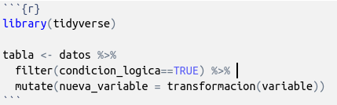
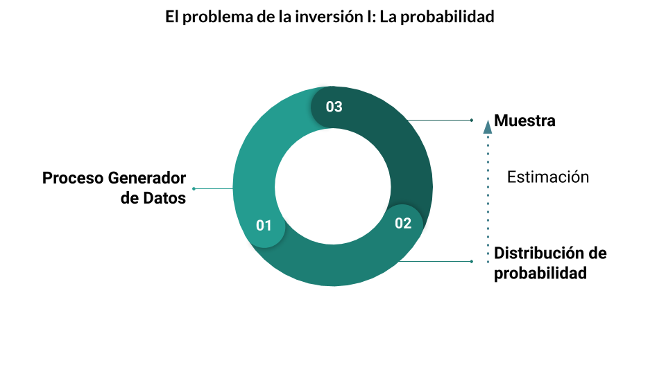
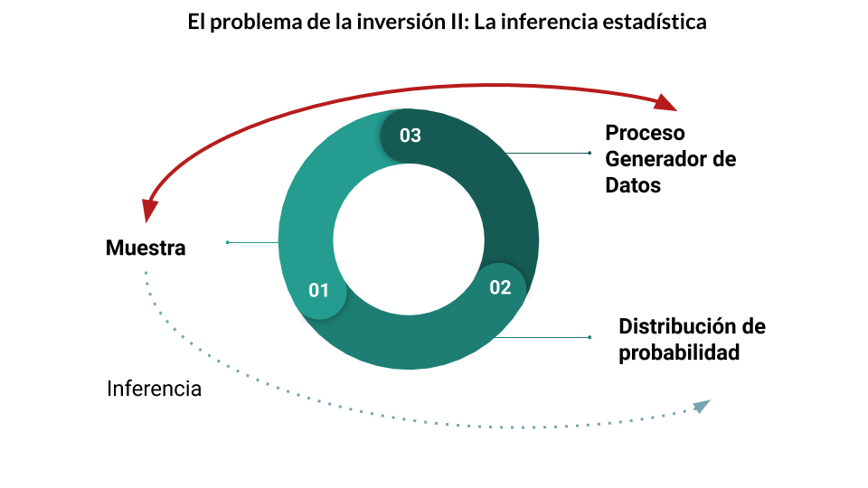

--- 
title: "Notas de clase del curso de introducción a Data Science"
author: "Diego Kozlowski y Natsumi Shokida"
date: "`r Sys.Date()`"
site: bookdown::bookdown_site
documentclass: book
bibliography: [book.bib, packages.bib]
biblio-style: apalike
link-citations: yes
description: "desarrollado para el Min. de Transporte (Argentina)"
---


# Introducción {-}

```{r, include = FALSE}
knitr::opts_chunk$set(warning = FALSE, message = FALSE, fig.width = 10, fig.height = 10)
```

{width=1000}

### Presentación {-}

En los últimos años se han difundido muchas herramientas estadísticas novedosas para el análisis de información socioeconómica y geográfica. En particular el software denominado “R”, por tratarse de un software libre, se extiende cada vez más en diferentes disciplinas y recibe el aporte de investigadores e investigadoras en todo el mundo, multiplicando sistemáticamente sus capacidades.

Este programa se destaca, entre otras cosas, por su capacidad de trabajar con grandes volúmenes de información, utilizar múltiples bases de datos en simultáneo, generar reportes, realizar gráficos a nivel de publicación y por su comunidad de usuarios que publican sus sintaxis y comparten sus problemas, hecho que potencia la capacidad de consulta y de crecimiento. A su vez, la expresividad del lenguaje permite diseñar funciones específicas que permiten optimizar de forma personalizada el trabajo cotidiano con R.

### Objetivos del curso {-}

El presente Taller tiene como objetivo principal introducir a los participantes en la ciencia de datos, sobre la base de la utilización del lenguaje R aplicado procesamiento de diferentes bases de datos provistas por el programa de Gobierno Abierto y la Encuesta Permanente de Hogares (EPH) - INDEC.  Se apunta a brindar las herramientas necesarias para la gestión de la información, presentación de resultados y algunas técnicas de modelado de datos, de forma tal que los participantes puedan luego avanzar por su cuenta a técnicas más avanzadas.


### [Webpage](https://diegokoz.github.io/intro_ds/) {-}


### Temario: {-}

#### __Eje 1. Programación en R__ {-}


__clase 1__: Introducción al entorno R:
	
+ Descripción del programa “R”. Lógica sintáctica del lenguaje y comandos básicos
+ Presentación de la plataforma RStudio para trabajar en “R”
+ Caracteres especiales en “R”
+ Operadores lógicos y aritméticos
+ Definición de Objetos: Valores, Vectores y DataFrames
+ Tipos de variable (numérica, de caracteres, lógicas)
+ Lectura y Escritura de Archivos

__clase 2__: Tidyverse:

+ Limpieza de Base de datos: Renombrar y recodificar variables, tratamiento de valores faltantes (missing values/ NA´s)
+ Seleccionar variables, ordenar y agrupar la base de datos para realizar cálculos
+ Creación de nuevas variables
+ Aplicar filtros sobre la base de datos
+ Construir medidas de resumen de la información
+ Tratamiento de variables numéricas (edad, ingresos, horas de trabajo, cantidad de hijos / componentes del hogar, entre otras).

__clase 3__: Programación funcional

+ Estructuras de código condicionales
+ Loops
+ Creación de funciones a medida del usuario
+ Librería purrr para programación funcional


#### __Eje 2. Presentación de resultados__ {-}


__clase 4__: Visualización de la información

+ Gráficos básicos de R (función “plot”): Comandos para la visualización ágil de la información
+ Gráficos elaborados en R (función “ggplot”): 
+ Gráficos de línea, barras, Boxplots y distribuciones de densidad
+ Parámetros de los gráficos: Leyendas, ejes, títulos, notas, colores
+ Gráficos con múltiples cruces de variables.

__clase 5__: Documentación en R

+ Manejo de las extensiones del software “Rmarkdown” y “RNotebook” para elaborar documentos de trabajo, presentaciones interactivas e informes:
+ Opciones para mostrar u ocultar código en los reportes
+ Definición de tamaño, títulos y formato con el cual se despliegan los gráficos y tablas en el informe
+ Caracteres especiales para incluir múltiples recursos en el texto del informe: Links a páginas web, notas al pie, enumeraciones, cambios en el formato de letra (tamaño, negrita, cursiva)
+ Código embebido en el texto para automatización de reportes

__clase 6__: Shiny

+ Shiny como reportes dinámicos
+ Su utilidad para el análisis exploratorio
+ Lógica de servidor- interfaz de usuario
+ Inputs- Outputs, funciones reactivas, widgets.


#### __Eje 3. Estadística__ {-}

__clase 7__: Estadística descriptiva

+ Introducción a probabilidad
+ Introducción a distribuciones
+ El problema de la inversión
+ Estadística
+ Población y muestra
+ Estimadores puntuales, tests de hipótesis
+ Boxplots, histogramas y kernels

__clase 8__: Correlación y Modelo Lineal

+ Análisis de correlación.
+ Presentación conceptual del modelo lineal
+ El modelo lineal desde una perspectiva computacional
+ Supuestos del modelo lineal
+ Modelo lineal en R
+ Modelo lineal en el tidyverse


#### __Eje 4. Clases temáticas__ {-}

__clase 9__: Análisis de encuestas

+ Introducción al diseño de encuestas
+ Presentación de la Encuesta Permanente de Hogares
+ Generación de estadísticos de resumen en muestras estratificadas
+ Utilización de los ponderadores

__clase 10__: Mapas

+ Utilización de información geográfica en R
+ Elaboración de mapas
+ gestión de shapefiles

__clase 11__: Text Mining

  + Introducción al análisis de textos
  + Limpieza
  + Preprocesamiento
  + BoW
  + Stopwords
  + TF-IDF
  + Wordcloud
  + Escrapeo de Twitter


### Bibliografía de consulta {-}


- GWickham, H., & Grolemund, G. (2016). R for data science: import, tidy, transform, visualize, and model data. " O'Reilly Media, Inc.". https://es.r4ds.hadley.nz/
- James, G., Witten, D., Hastie, T., & Tibshirani, R. (2013). An introduction to statistical learning. New York: springer. http://faculty.marshall.usc.edu/gareth-james/ISL/
- Wickham, Hadley. ggplot2: elegant graphics for data analysis. Springer, 2016. https://ggplot2-book.org/


#### Librerias a instalar {-}

```
install.packages(c("tidyverse","openxlsx","xlsx",'ggplot2','GGally','ggridges','treemapify','esquisse','cowplot','ggthemes', 'ggrepel', 'ggalt', 'kableExtra', 'fs', 'purrr', 'rmarkdown', 'modelr', 'plot3D'))
```

<!--chapter:end:index.Rmd-->

# Introducción a R

En esta primera clase revisaremos los fundamentos de R base y el entorno de RStudio. El objetivo es poder comenzar a utilizar el programa, abrir archivos y empezar a experimentar para ganar confianza.

+ Descripción del programa _R_. Lógica sintáctica del lenguaje y comandos básicos
+ Presentación de la plataforma RStudio para trabajar en _R_
+ Caracteres especiales en _R_
+ Operadores lógicos y aritméticos
+ Definición de objetos: valores, vectores y DataFrames
+ Tipos de variable (numéricas, de caracteres, lógicas)
+ Lectura y escritura de archivos

## Explicación

{width=500}

### ¿Qué es R?

- Lenguaje para el procesamiento y análisis estadístico de datos
- Software Libre
- Sintaxis Básica: R base 
- Sintaxis incremental[^1]: El lenguaje se va ampliando por aportes de Universidades, investigadores/as, usuarios/as y empresas privadas, organizados en librerías (o paquetes)
- Comunidad web muy grande para realizar preguntas y despejar dudas. Por ejemplo, en el caso de Buenos Aires contamos con [R-Ladies Buenos Aires](https://www.meetup.com/es-ES/rladies-buenos-aires/) y [RenBaires](https://www.meetup.com/es-ES/renbaires/).
- Gráficos con calidad de publicación

[^1]: Más allá de los comandos elementales, comandos más sofisticados tienen muchas versiones, y algunas quedan en desuso en el tiempo.

{width=1000}


{width=750}

Uno de los _entornos_ más cómodos para utilizar el _lenguaje_ __R__ es el _programa_ __R studio__.

- Rstudio es una empresa que produce productos asociados al lenguaje R, como el programa sobre el que corremos los comandos, y extensiones del lenguaje (librerías).
 
- El programa es _gratuito_ y se puede bajar de la 
[página oficial](https://www.rstudio.com/) 


{width=750}


### Lógica sintáctica.

#### Definición de objetos
Los __Objetos/Elementos__ constituyen la categoría esencial del R. De hecho, todo en R es un objeto, y se almacena con un nombre específico que **no debe poseer espacios**. Un número, un vector, una función, la progresión de letras del abecedario, una base de datos, un gráfico, constituyen para R objetos de distinto tipo. Los objetos que vamos creando a medida que trabajamos pueden visualizarse en el panel derecho superior de la pantalla (el _Environment_). 

El operador __```<-```__ (__Alt + Guión__) sirve para definir un objeto.  __A la izquierda__ del __```<-```__ debe ubicarse el nombre que tomará el elemento a crear. __Del lado derecho__ debe ir la definición del mismo.


```{r}
A <- 1
```

Por ejemplo, podemos crear el elemento __A__, cuyo valor será 1. Para esto, debemos _correr_ el código presionando __Ctrl + Enter__, con el cursor ubicado en cualquier parte de la línea. Al definir un elemento, el mismo queda guardado en el ambiente del programa, y podrá ser utilizado posteriormente para observar su contenido o para realizar una operación con el mismo.

```{r}
A 
A+6
```

Al correr una linea con el nombre del objeto, la consola del programa nos muestra su contenido. Entre corchetes observamos el número de orden del elemento en cuestión. Si corremos una operación, la consola nos muestra el resultado de la misma.

El operador __```=```__ es __equivalente__ a __```<-```__, pero en la práctica no se utiliza para la definición de objetos.   

```{r}
B = 2
B
```

__```<-```__ es un operador __Unidireccional__, es decir que:     
```A <- B``` implica que __A__ va tomar como valor el contenido del objeto __B__, y no al revés.

```{r}
A <- B
A      # Ahora A toma el valor de B, y B continúa conservando el mismo valor
B
```


### R base

Con _R base_ nos referimos a los comandos básicos que vienen incorporados en el R, sin necesidad de cargar librerías. 

#### Operadores lógicos: 

- $>$ (mayor a-)
- $>=$ (mayor o igual a-)
- $<$ (menor a-)
- $<=$ (menor o igual a-)
- $==$ (igual a-)
- $!=$ (distinto a-)

```{r}
# Redefinimos los valores A y B
A <- 10
B <- 20

# Realizamos comparaciones lógicas
A >  B
A >= B
A <  B
A <= B
A == B
A != B

C <- A != B
C
```

Como muestra el último ejemplo, el resultado de una operación lógica puede almacenarse como el valor de un objeto.

#### Operadores aritméticos:

```{r}
#suma
A <- 5+6
A
#Resta
B <- 6-8
B
#cociente
C <- 6/2.5
C
#multiplicacion
D <- 6*2.5
D
```

#### Funciones:
Las funciones son series de procedimientos estandarizados, que toman como imput determinados argumentos a fijar por el usuario, y devuelven un resultado acorde a la aplicación de dichos procedimientos. Su lógica de funcionamiento es:   
```funcion(argumento1 = arg1, argumento2 = arg2)```      

A lo largo del curso iremos viendo numerosas funciones, según lo requieran los distintos ejercicios. Sin embargo, veamos ahora algunos ejemplos para comprender su funcionamiento:    

- paste() : concatena una serie de caracteres, pudiendo indicarse cómo separar a cada uno de ellos        
- paste0(): concatena una serie de caracteres sin separar
- sum(): suma de todos los elementos de un vector   
- mean() promedio aritmético de todos los elementos de un vector   

```{r}
paste("Pega", "estas", 4, "palabras", sep = " ")

#Puedo concatenar caracteres almacenados en objetos
paste(A, B, C, sep = "**")

# Paste0 pega los caracteres sin separador
paste0(A, B, C)

1:5

sum(1:5)

mean(1:5, na.rm = TRUE)
```


#### Caracteres especiales

- R es sensible a mayúsculas y minúsculas, tanto para los nombres de las variables, como para las funciones y parámetros.
- Los __espacios en blanco__ y los __carriage return__ (_enter_) no son considerados por el lenguaje. Los podemos aprovechar para emprolijar el código y que la lectura sea más simple[^2].

[^2]: veremos que existen ciertas excepciones con algunos paquetes más adelante. 

- El __numeral__ ```#``` se utiliza para hacer comentarios. Todo lo que se escribe después del # no es interpretado por R. Se debe utilizar un # por cada línea de código que se desea anular

- Los __corchetes__ ```[]``` se utilizan para acceder a un objeto:
    - en un vector[n° orden]
    - en una tabla[fila, columna]
    - en una lista[n° elemento]
- el signo __$__ también es un método de acceso. Particularmente, en los dataframes, nos permitira acceder a una determinada columna de una tabla

- Los __paréntesis__```()``` se utilizan en las funciones para definir los parámetros.

- Las __comas__ ```, ```  se utilizan para separar los parametros al interior de una función. 

### Objetos:    
Existe una gran cantidad de objetos distintos en R, en lo que resepcta al curso trabajaremos principalmente con 3 de ellos:

- Valores
- Vectores
- Data Frames
- Listas

#### Valores
Los valores y vectores pueden ser a su vez de distintas _clases_:   

__Numeric__     

```{r}
A <-  1
class(A)
```


__Character__
```{r}
A <-  paste('Soy', 'una', 'concatenación', 'de', 'caracteres', sep = " ")
A
class(A)
```


__Factor__
```{r}
A <- factor("Soy un factor, con niveles fijos")
class(A)
```

La diferencia entre un _character_ y un _factor_ es que el último tiene solo algunos valores permitidos (levels), con un orden interno predefinido (el cual, por ejemplo, se respetará a la hora de realizar un gráfico)  


#### Vectores

Para crear un __vector__ utilizamos el comando ```c()```, de combinar.

```{r}
C <- c(1, 3, 4)
C
```

Podemos sumarle 2 a cada elemento del __vector__ anterior

```{r}
C <- C + 2
C
```

O sumarle 1 al primer elemento, 2 al segundo, y 3 al tercer elemento del __vector__ anterior
```{r}
D <- C + 1:3 # esto es equivalente a hacer 3+1, 5+2, 6+9 
D
```

```1:3``` significa que queremos todos los números enteros desde 1 hasta 3. 

Podemos crear un __vector__ que contenga las palabras: "Carlos", "Federico", "Pedro"
```{r}
E <- c("Carlos", "Federico", "Pedro")
E
```

Para acceder a algún elemento del vector, podemos buscarlo por su número de orden, entre ```[ ]```

```{r}
E[2]
```

Si nos interesa almacenar dicho valor, al buscarlo lo asignamos a un nuevo objeto, dándole el nombre que deseemos

```{r}
elemento2 <- E[2]
```

```{r}
elemento2
```

Para __borrar__ un objeto del ambiente de trabajo, utilizamos el comando _```rm()```_

```{r error=TRUE}
rm(elemento2)
elemento2
```

También podemos cambiar el texto del segundo elemento de E, por el texto "Pablo"

```{r}
E[2] <- "Pablo"
E
```

### Data Frames

Un Data Frame es una tabla de datos, donde cada columna representa una variable, y cada fila una observación.

Este objeto suele ser central en el proceso de trabajo, y suele ser la forma en que se cargan datos externos para trabajar en el ambiente de R, y en que se exportan los resultados de nuestros trabajo.  

También se puede crear como la combinación de N vectores de igual tamaño. Por ejemplo, tomamos algunos valores del [Indice de salarios](http://www.indec.gob.ar/bajarCuadroEstadistico.asp?idc=4020B33440609462654542BD0BC320F1523DA0DC52C396201DB4DD5861FFEDC9AD1436681AC84179)

```{r}
INDICE  <- c(100,   100,   100,
             101.8, 101.2, 100.73,
             102.9, 102.4, 103.2)

FECHA  <-  c("Oct-16", "Oct-16", "Oct-16",
             "Nov-16", "Nov-16", "Nov-16",
             "Dic-16", "Dic-16", "Dic-16")

GRUPO  <-  c("Privado_Registrado","Público","Privado_No_Registrado",
             "Privado_Registrado","Público","Privado_No_Registrado",
             "Privado_Registrado","Público","Privado_No_Registrado")
             
Datos <- data.frame(INDICE, FECHA, GRUPO)
Datos
```

Tal como en un __vector__ se ubica a los elementos mediante ```[ ]```, en un __dataframe__ se obtienen sus elementos de la forma __```[fila, columna]```__.

Otra opción es especificar la columna, mediante el operador __```$```__, y luego seleccionar dentro de esa columna el registro deseado mediante el número de orden.

```{r}
Datos$FECHA
Datos[3,2]
Datos$FECHA[3]
```

¿que pasa si hacemos ```Datos$FECHA[3,2]``` ?

```{r error=TRUE}
Datos$FECHA[3,2]
```

Nótese que el último comando tiene un número incorrecto de dimensiones, porque estamos refiriendonos 2 veces a la columna FECHA.    

Acorde a lo visto anteriormente, el acceso a los __dataframes__ mediante  ```[ ]``` puede utilizarse para realizar filtros sobre la base, especificando una condición para las filas. Por ejemplo, puedo utilizar los  ```[ ]``` para conservar del __dataframe__ ```Datos ```  unicamente los registros con fecha de Diciembre 2016:

```{r error=TRUE}
Datos[Datos$FECHA=="Dic-16",]
```

La lógica del paso anterior sería: Accedo al dataframe ```Datos```, pidiendo únicamente conservar las filas (por eso la condición se ubica a la _izquierda_ de la  ```, ```) que cumplan el requisito de pertenecer a la categoría __"Dic-16"__ de la variable __FECHA__.      

Aún más, podría aplicar el filtro y al mismo tiempo identificar una variable de interés para luego realizar un cálculo sobre aquella. Por ejemplo, podría calcular la media de los indices en el mes de Diciembre. 

```{r error=TRUE}
###Por separado
Indices_Dic <- Datos$INDICE[Datos$FECHA=="Dic-16"]
Indices_Dic
```

```{r error=TRUE}
mean(Indices_Dic)
```

```{r error=TRUE}
### Todo junto
mean(Datos$INDICE[Datos$FECHA=="Dic-16"])
```

La lógica de esta sintaxis sería: "Me quedo con la variable __INDICE__, cuando la variable FECHA sea igual a __"Dic-16"__, luego calculo la media de dichos valores".

### Listas

Contienen una concatenación de objetos de cualquier tipo. Así como un vector contiene valores, un dataframe contiene vectores, una lista puede contener dataframes, pero también vectores, o valores, y _todo ello a la vez_.

```{r}
superlista <- list(A,B,C,D,E,FECHA, DF = Datos, INDICE, GRUPO)
superlista
```

Para acceder un elemento de una lista, podemos utilizar el operador __```$```__, que se puede usar a su vez de forma iterativa. 

```{r}
superlista$DF$FECHA[2]
```

### Ambientes de trabajo

Hay algunas cosas que tenemos que tener en cuenta respecto del orden del ambiente en el que trabajamos:

- Working Directory: Es el directorio de trabajo. Pueden ver el suyo con `getwd()`, es *hacia donde apunta el código*, por ejemplo, si quieren leer un archivo, la ruta del archivo tiene que estar explicitada como el recorrido desde el Working Directory.
- Environment: Esto engloba tanto la información que tenemos cargada en *Data* y *Values*, como las librerías que tenemos cargadas mientras trabajamos. 

Es importante que mantengamos bien delimitadas estas cosas entre diferentes trabajos, sino:

1. El directorio queda referido a un lugar específico en nuestra computadora. 
  - Si se lo compartimos a otro **se rompe**
  - Si cambiamos de computadora **se rompe**
  - Si lo cambiamos de lugar **se rompe**
  - Si primero abrimos otro script **se rompe**
2. Tenemos mezclados resultados de diferentes trabajos:
  - Nunca sabemos si esa variable/tabla/lista se creo en ese script y no otro
  - Perdemos espacio de la memoria
  - No estamos seguros de que el script cargue todas las librerías que necesita

Rstudio tiene una herramienta muy útil de trabajo que son los **proyectos**. Estos permiten mantener un ambiente de trabajo delimitado por cada uno de nuestros trabajos. Es decir:

- El directorio de trabajo se refiere a donde esta ubicado el archivo .Rproj
- El Environment es específico de nuestro proyecto.

Un proyecto no es un sólo script, sino toda una carpeta de trabajo. 

{width=500}

Para crearlo, vamos al logo de nuevo projecto (Arriba a la derecha de la panatalla), y elegimos la carpeta de trabajo. 


### Tipos de archivos de R

- __Script__: Es un archivo de texto plano, donde podemos poner el código que utilizamos para preservarlo
- __Rnotebook__: También sirve para guardar el código, pero a diferencia de los scripts, se puede compilar, e intercalar código con resultados
- __Rproject__: Es un archivo que define la metadata del proyecto
- __RDS y Rdata__: Dos formatos de archivos propios de R para guardar datos. 

<!--chapter:end:01_explicacion.Rmd-->


## Práctica Guiada

### Instalación de paquetes complementarios al R Base          

Hasta aquí hemos visto múltiples funciones que están contenidas dentro del lenguaje básico de R. Ahora bien, al tratarse de un software libre, los usuarios de R con más experiencia contribuyen sistemáticamente a expandir este lenguaje mediante la creación y actualización de __paquetes__ complementarios. Lógicamente, los mismos no están incluidos en la instalación inicial del programa, pero podemos descargarlos e instalarlos al mismo tiempo con el siguiente comando:   
``` 
install.packages("nombre_del_paquete") 
```
Resulta recomendable __ejecutar este comando desde la consola__ ya que sólo necesitaremos correrlo una vez en nuestra computadora. Al ejecutar el mismo, se descargarán de la pagina de [CRAN](www.cran.r-project.org) los archivos correspondientes al paquete hacia el directorio en donde hayamos instalado el programa. Típicamente los archivos se encontrarán en __`C:\Program Files\R\R-3.5.0\library\`__, siempre con la versión del programa correspondiente.              
Una vez instalado el paquete, cada vez que abramos una nueva sesión de R y querramos utilizar el mismo debemos **cargarlo al ambiente de trabajo** mediante la siguiente función:
``` 
library(nombre_del_paquete)
```
Nótese que al cargar/activar el paquete no son necesarias las comillas.

### Lectura y escritura de archivos

#### .csv  y  .txt

Hay __muchas__ funciones para leer archivos de tipo _.txt_ y _.csv_. La mayoría sólo cambia los parámetros que vienen por default. 

Es importante tener en cuenta que una base de datos que proviene de archivos _.txt_, o _.csv_ puede presentar diferencias en cuanto a los siguientes parámetros:

- encabezado
- delimitador (```,```, tab, ```;```)
- separador decimal 


``` 
dataframe <- read.delim(file, header = TRUE, sep = "\t", quote = "\"", dec = ".", fill = TRUE, comment.char = "", ...) 
```

Ejemplo. Levantar la base de [sueldos de funcionarios](https://data.buenosaires.gob.ar/dataset/sueldo-funcionarios)

En el parametro `file` tengo que especificar el nombre completo del archivo, incluyendo el directorio donde se encuentra. Lo más sencillo es abrir comillas, apretar `Tab` y se despliega el menú de las cosas que tenemos en el directorio de trabajo. Si queremos movernos hacia arriba, agregamos `../`


```{r echo=TRUE, message=FALSE, warning=FALSE}
sueldos_funcionarios <- read.table(file = 'fuentes/sueldo_funcionarios_2019.csv',sep=",", header = TRUE)
sueldos_funcionarios[1:10,]
```
Como puede observarse aquí, la base cuenta con 94 registros y 10 variables.  
Al trabajar con bases de microdatos, resulta conveniente contar con algunos comandos para tener una mirada rápida de la base, antes de comenzar a realizar los procesamientos que deseemos.     

Veamos algunos de ellos:

```{r}
#view(sueldos_funcionarios)
names(sueldos_funcionarios)
summary(sueldos_funcionarios)
head(sueldos_funcionarios)[,1:5]
```


#### Excel 


Para leer y escribir archivos excel podemos utilizar los comandos que vienen con la librería _openxlsx_

```{r,warning=FALSE}

# install.packages("openxlsx") # por única vez
library(openxlsx) #activamos la librería

# creamos una tabla cualquiera de prueba
x <- 1:10
y <- 11:20
tabla_de_R <- data.frame(x,y)

# escribimos el archivo
write.xlsx(x = tabla_de_R, file = "resultados/archivo.xlsx", row.names = FALSE)
# Donde lo guardó? Hay un directorio por default en caso de que no hayamos definido alguno.

# getwd()

# Si queremos exportar multiples dataframes a un Excel, debemos armar previamente una lista de ellos. Cada dataframe se guardará en una pestaña de excel, cuyo nombre corresponderá al que definamos para cada Dataframe a la hora de crear la lista.
Lista_a_exportar <- list("sueldos funcionarios" = sueldos_funcionarios,
                         "Tabla Numeros" = tabla_de_R)

write.xlsx(x = Lista_a_exportar, file = "resultados/archivo_2_hojas.xlsx", row.names = FALSE)

# leemos el archivo especificando la ruta (o el directorio por default) y el nombre de la hoja que contiene los datos
Indices_Salario <- read.xlsx(xlsxFile = "resultados/archivo_2_hojas.xlsx", sheet = "sueldos funcionarios")

# alternativamente podemos especificar el número de orden de la hoja que deseamos levantar
Indices_Salario <- read.xlsx(xlsxFile = "resultados/archivo_2_hojas.xlsx", sheet = 1)
Indices_Salario[1:10,]
```


<!--chapter:end:01_practica_guiada.Rmd-->


# Tidyverse   

+ Limpieza de Base de datos: Renombrar y recodificar variables, tratamiento de valores faltantes (missing values/ NA´s)
+ Seleccionar variables, ordenar y agrupar la base de datos para realizar cálculos
+ Creación de nuevas variables
+ Aplicar filtros sobre la base de datos
+ Construir medidas de resumen de la información
+ Tratamiento de variables numéricas (edad, ingresos, horas de trabajo, cantidad de hijos / componentes del hogar, entre otras).

## Explicación

A lo largo de esta clase, trabajaremos con el paquete [__tidyverse__](https://www.tidyverse.org/). El mismo agrupa una serie de paquetes que tienen una misma lógica en su diseño y por ende funcionan en armonía.     
Entre ellos, usaremos principalmente __dplyr__ y __tidyr__ para realizar transformaciones sobre nuestro set de datos. En una futura clase utilizaremos __ggplot__ para realizar gráficos.   
      
A continuación cargamos la librería a nuestro ambiente. Para ello debe estar previamente instalada en nuestra pc.
```{r echo=TRUE, message=FALSE, warning=FALSE}
library(tidyverse)
```

Para mostrar el funcionamiento básico de tidyverse utilizaremos a modo de ejemplo datos del [Informe de Mercado de Trabajo del INDEC](https://www.indec.gob.ar/uploads/informesdeprensa/mercado_trabajo_eph_1trim19B489ACCDF9.pdf).    
```{r echo=TRUE, message=FALSE, warning=FALSE}
INDICADOR <- c("Tasa de Actividad", "Tasa de Empleo", "Tasa de Desocupación",
               "Tasa de Actividad", "Tasa de Empleo", "Tasa de Desocupación",
               "Tasa de Actividad", "Tasa de Empleo", "Tasa de Desocupación")

FECHA <-     c("2018.3T", "2018.3T", "2018.3T",
               "2018.4T", "2018.4T", "2018.4T",
               "2019.1T", "2019.1T", "2019.1T")

TASA <-      c(46.7, 42.5, 9,
               46.5, 42.2, 9.1, 
               47,   42.3, 10.1)

Datos <- data.frame(INDICADOR, FECHA, TASA)
Datos
```

### Dplyr

El caracter principal para utilizar este paquete es ```%>%``` , _pipe_ (de tubería).   

Los ```%>%``` toman el set de datos a su izquierda, y los transforman mediante los comandos a su derecha, en los cuales los elementos de la izquierda están implícitos. En otros términos:  

$f(x,y)$ es equivalente a $x$ %>% $f(.,y)$ 

Veamos las principales funciones que pueden utilizarse con la lógica de este paquete:

#### glimpse

Permite ver la estructura de la tabla. Nos muestra: 

* número de filas
* número de columnas
* nombre de las columnas
* tipo de dato de cada columna
* las primeras observaciones de la tabla

```{r, eval = FALSE}
glimpse(Datos)
```


#### filter

Permite filtrar la tabla de acuerdo al cumplimiento de condiciones lógicas.
 
```{r}
Datos %>% 
  filter(TASA > 10 , INDICADOR == "Tasa de Desocupación")
```

Nótese que en este caso al separar con una  __,__ las condiciones se exige el cumplimiento de ambas. En caso de desear que se cumpla alguna de las condiciones debe utilizarse el caracter __|__.

```{r}
Datos %>% 
  filter(TASA > 10 | INDICADOR == "Tasa de Desocupación")
```

#### rename

Permite renombrar una columna de la tabla. Funciona de la siguiente manera:  
  
 ```Data %>% rename(nuevo_nombre = viejo_nombre)``` 

```{r}
Datos %>% 
  rename(Periodo = FECHA)
```

Nótese que, a diferencia del ejemplo de la función __filter__ donde utilizábamos __==__ para comprobar una condición lógica, en este caso se utiliza sólo un __=__ ya que lo estamos haciendo es _asignar_ un nombre.

#### mutate

Permite agregar una variable a la tabla (especificando el nombre que tomará ésta), que puede ser el resultado de operaciones sobre otras variables de la misma tabla.       

En caso de especificar el nombre de una columna existente, el resultado de la operación realizada "sobre-escribirá" la información de la columna con dicho nombre.

```{r}
Datos <- Datos %>% 
  mutate(PROPORCION = TASA / 100)

Datos
```

#### case_when

Permite definir una variable, de forma tal que tome un valor particular para cada condición establecida. En caso de no cumplir con ninguna de las condiciones establecidas, la variable tomará valor __NA__.   
La sintaxis de la función es:   
`case_when(condicion lógica1 ~ valor asignado1)`

```{r}
Datos <- Datos %>% 
  mutate(CODIGO = case_when(INDICADOR == "Tasa de Actividad"    ~ "ACT",
                            INDICADOR == "Tasa de Empleo"       ~ "EMP",
                            INDICADOR == "Tasa de Desocupación" ~ "DES"))

Datos
```

Si querémos asignar un valor a todo lo que no cumple ningúna de las condiciones anteriores, podemos poner `TRUE ~ valor`

#### select

Permite especificar la serie de columnas que se desea conservar de un DataFrame. También pueden especificarse las columnas que se desean descartar (agregándoles un _-_ adelante). Muy útil para agilizar el trabajo en bases de datos de gran tamaño.

```{r}
Datos2 <- Datos %>% 
  select(CODIGO, FECHA, PROPORCION)
Datos2

Datos <- Datos %>% 
  select(-c(PROPORCION, CODIGO))
Datos
```

#### arrange

Permite ordenar la tabla según los valores de determinada/s variable/s. Es útil cuando luego deben hacerse otras operaciones que requieran del ordenamiento de la tabla, o para mostrar resultados de forma ordenada.

```{r}
Datos <- Datos %>% 
  arrange(INDICADOR, FECHA)

Datos
```

#### summarise

Crea una nueva tabla que resuma la información original. Para ello, definimos las variables de resumen y las formas de agregación.

```{r}
Datos %>% 
  filter(INDICADOR == "Tasa de Desocupación") %>% 
  summarise(INDICE_MAX = max(TASA),
            INDICE_MIN = min(TASA),
            INDICE_PROM = mean(TASA))
```

#### group_by

Esta función permite realizar operaciones de forma agrupada. Lo que hace la función es "separar" a la tabla según los valores de la variable indicada y realizar las operaciones que se especifican a continuación, de manera independiente para cada una de las "subtablas". En nuestro ejemplo, podría ser útil para calcular el promedio de las tasas por _INDICADOR_. 

```{r}
Datos %>% 
  group_by(INDICADOR) %>%
  summarise(INDICE_PROM = mean(TASA))
```

### Joins

Otra implementación muy importante del paquete dplyr son las funciones para unir tablas (joins).

         


#### left_join    

Veamos un ejemplo de la función __left_join__ (una de las más utilizadas en la práctica).       
Para ello crearemos previamente un Dataframe que contenga las cantidades de población total y población económicamente activa para cada uno de los períodos del Dataframe _Datos_.

```{r}
Poblaciones <- data.frame(FECHA = c("2018.3T", "2018.4T", "2019.1T"),
                          POBLACION_miles = c(27842, 27914, 28261),
                          PEA_miles = c(12990, 12979, 13285))

Poblaciones
```

Unimos nuestras dos tablas. La siguiente forma de realizarlo es equivalente a:   
`Datos_join <- left_join(Datos, Poblaciones, by = "FECHA")`

```{r}
Datos_join <- Datos %>% 
  left_join(Poblaciones, by = "FECHA")

Datos_join
```

Finalmente, podemos calcular la cantidad de personas desocupadas en cada uno de los períodos con los que contamos.

```{r}
Datos_join %>% 
  filter(INDICADOR == "Tasa de Desocupación") %>% 
  group_by(FECHA) %>% 
  summarise(DESOCUP_miles = round(TASA/100 * PEA_miles, 0))
```

### Tidyr

El paquete tidyr está pensado para facilitar el emprolijamiento de los datos.

__Gather__ es una función que nos permite pasar los datos de forma horizontal a una forma vertical. 

__spread__ es una función que nos permite pasar los datos de forma vertical a una forma horizontal.


```{r}
# Utilizamos un conjunto de datos que viene con la librería datasets
library(datasets)

head(iris)
```

```{r}
iris <- iris %>% 
  mutate(id = 1:nrow(.)) %>%  # le agrego un ID
  select(id, everything())    # lo acomodo para que el id este primero. 

head(iris)
```

#### Gather y Spread

```{r}
iris_vertical <- iris %>% gather(., # el . llama a lo que esta atras del %>% 
                                 key   = Variables,
                                 value = Valores,
                                 2:5) #le indico qué columnas juntar
head(iris_vertical)
```

Podemos deshacer el __gather__ con un __Spread__
```{r}
iris_horizontal <- iris_vertical %>%
  spread(. ,
         key   = Variables, # la llave es la variable que va a dar los nombres de columna
         value = Valores) # los valores con que se llenan las celdas

head(iris_horizontal)
```

### Lubridate

El paquete lubridate está pensado para trabajar con los datos tipo fecha (date) o fecha-hora (datetime) para cambiarles el formato, realizar operaciones y extraer información

```{r}
library(lubridate)
```

#### Cambio de formato

Existe una gran cantidad de funciones para realizar esto. La idea general es poder llevar los objetos datetime a un formato común compuesto de los elementos: año, mes, día, hora, minuto y segundo (también se puede setear el huso horario)

```{r}
fecha  <- "04/12/92 17:35:16"
fecha
```

Con la función dmy_hms podemos convertir este string a una fecha: estamos indicando que el formato de la fecha es día(d), mes(m), año(y), hora(h), minuto(m) y segundo(s).

```{r}
fecha  <- dmy_hms(fecha)
fecha
```

Muchas funciones de lubridate operan con esta misma lógica.   

Otra función para realizar un cambio de formato es *parse_date_time*. Permite construir objetos datetime a partir de datos más complejos, como por ejemplo cuando aparece el nombre del mes y el año.    

En el parámetro *x* pasamos el dato de la fecha y en el parámetro *orders* especificamos el orden en el cual se encuentra la información de la fecha.

```{r}
fecha2  <- "Dec-92"
fecha2 <- parse_date_time(fecha2, orders = 'my')
fecha2
```

#### Extracción de información

Existen muchas funciones muy sencillas para extraer información de un objeto datetime. Algunas son:

```{r}
year(fecha)  # Obtener el año
month(fecha) # Obtener el mes
day(fecha)   # Obtener el día
wday(fecha, label = TRUE) # Obtener el nombre del día
hour(fecha) # Obtener la hora
```

#### Operaciones

Podemos sumar o restarle cualquier período de tiempo a un objeto datetime

```{r}
# Sumo dos días 
fecha + days(2)
# Resto 1 semana y dos horas
fecha - (weeks(1) + hours(2))
```


<!--chapter:end:02_explicacion.Rmd-->


## Práctica Guiada


En esta ocasión utilizaremos los datos de la librería `gapminder` para utilizar todo lo que aprendimos sobre el `tidyverse`.

```{r message=FALSE, warning=FALSE}
library(tidyverse)
library(gapminder)
```

```{r}
glimpse(gapminder)
```

### Ejemplo 1

> Calcular el promedio, el máximo y el mínimo de la esperanza de vida de cada continente en el año 2007. Presentar los datos ordenados según la esperanza de vida promedio.

Necesitamos filtrar los datos tal que sólo queden aquellos correspondientes a 2007. Luego, agrupamos los casos de acuerdo a su _continente_, y calculamos los indicadores agregados solicitados. Luego, ordenamos los resultados.

```{r}
ejercicio1 <- gapminder %>% 
  filter(year == 2007) %>% 
  group_by(continent) %>% 
  summarise(esp_vida_prom = mean(lifeExp),
            esp_vida_max =  max(lifeExp),
            esp_vida_min =  min(lifeExp)) %>% 
  arrange(esp_vida_prom)

ejercicio1
```

### Ejemplo 2

> Construir una nueva variable en el dataset que contenga una estimación del PBI. Estimar la mediana del PBI, y construir otra variable que tome valor "ALTO" cuando el PBI supera ese valor, y "BAJO" cuando no.

Calculamos el PBI como el producto entre la población y el PBI per cápita para cada uno de los países y años. A continuación, guardamos el cálculo de la mediana del PBI en un valor llamado _mediana_GDP_. Por último, utilizamos la función `case_when` para poder construir la variable de nivel de PBI de acuerdo a la condición lógica solicitada. Nótese que el dataframe `ejercicio2` ha sido re-escrito.

```{r}
ejercicio2 <- gapminder %>% 
  mutate(GDP = pop * gdpPercap)

mediana_GDP <- median(ejercicio2$GDP)

ejercicio2 <- ejercicio2 %>% 
  mutate(GDP_level = case_when(GDP > mediana_GDP ~ "ALTO",
                               GDP < mediana_GDP ~ "BAJO"))

head(ejercicio2)
```

### Ejemplo 3

> Crear una copia de la base donde sólo se conserven las variables _country_, _year_ y _lifeExp_, pero con los nombres _pais_, _anio_ y _espVida_.

Utilizamos `select()` para quedarnos con las columnas solicitadas, y `rename()` para cambiar sus nombres.

```{r}
ejercicio3 <- gapminder %>% 
  select(country, year, lifeExp) %>% 
  rename(pais = country,
         anio = year,
         espVida = lifeExp)

head(ejercicio3)
```

### Ejemplo 4

> Crear una copia de la base donde sólo se conserven las variables _country_, _year_ y _gdpPercap_, pero con los nombres _pais_, _anio_ y _pbiPercap_.

```{r}
ejercicio4 <- gapminder %>% 
  select(country, year, gdpPercap) %>% 
  rename(pais = country,
         anio = year,
         pbiPercap = gdpPercap)

head(ejercicio4)
```

### Ejemplo 5

> Crear una nueva tabla que contenga los datos de las tablas `ejercicio3` y `ejercicio4`. Deben unirse de acuerdo al _pais_ y al _anio_.

Podemos utilizar la función `left_join()`.

```{r}
ejercicio5 <- left_join(ejercicio3, ejercicio4, by = c("pais", "anio"))

head(ejercicio5)
```

### Ejemplo 6

> Presentar los datos de la tabla `ejercicio1` de forma tal que _esp_vida_prom_, _esp_vida_max_ y _esp_vida_min_ sean valores de una variable llamada _indicador_, y los valores se encuentren en la variable _valor_.

Utilizamos `gather()`, porque queremos transformar los datos de un formato "horizontal" a uno "vertical".

```{r}
ejercicio6 <- ejercicio1 %>% 
  gather(., key = indicador, value = valor, 2:4)

head(ejercicio6)
```


<!--chapter:end:02_practica_guiada.Rmd-->

# Programacion Funcional

El objetivo de esta clase es introducir a los alumnos en el uso de la programación funcional. Es decir, en la utilización de funciones y el uso de controles de flujo de la información para la organización de su código.


+ Estructuras de código condicionales
+ Loops
+ Creación de funciones a medida del usuario
+ Librería purrr para programación funcional

## Explicación


```{r message=FALSE, warning=FALSE}
library(tidyverse)
```


### Loops

Un __loop__ es una estructura de código que nos permite aplicar iterativamente un mismo conjunto de comandos, variando el valor de una variable. Por ejemplo:

```{r,warning=FALSE}
for(i in 1:10){
   print(i^2)
}
```

Esto se lee como : "Recorre cada uno de los valores (i) del vector numérico 1 a 10, y para cada uno de ellos imprimí el cuadrado (i^2)".                  
Uno puede especificar la palabra que desee que tomé cada uno de los valores que debe tomar. En el ejemplo anterior fue **i**, pero bien podría ser la "**Valores**"  

```{r}
for(Valores in 1:10){
   print(Valores^2)
  
}
```

Un loop puede iterar sobre cualquier tipo de vector, independientemente de lo que contenga.

> Los loops son una estructura básica que existen en cualquier lenguaje de programación. En R no recomendamos abusar de ellos porque hacen que el código sea más lento.


### Estructuras Condicionales

Las __estructuras condiconales__ nos permiten ejecutar una porción de código en caso de que cumplan una condición lógica

#### if
Su funcionamiento es el siguiente:     
```if(condicion){codigo a ejecutar si se cumple la condición}```


```{r,warning=FALSE}
if( 2+2 == 4){
  print("Menos Mal")
}

```

```{r,warning=FALSE}
if( 2+2 == 148.24){
  print("R, tenemos un problema")
}

```


#### ifelse
La función ```if_else()``` sirve para crear o modificar dicotómicamente un objeto/variable/vector a partir del cumplimiento de una o más condiciones lógicas.  
Su funcionamiento es el siguiente:      
```if_else(condicion,función a aplicar si se cumple la condición,función a aplicar si no se cumple la condición)```

```{r}
if_else(2+2==4, true = "Joya",false = "Error")
```

### Funciones

La creación de __funciones__ propias nos permite automatizar todas aquellas partes del código que se repiten mucho. Una vez diseñadas, funcionan igual que cualquier comando. 

Por ejemplo, podemos definir la suma de dos elementos como


```{r}
suma <- function(valor1, valor2) {
  valor1+valor2
}

suma(5,6)
```


Obviamente las funciones no son sólo para variables numéricas. Por ejemplo, podemos pegar dos strings con una flecha en el medio

```{r}
funcion_prueba <- function(parametro1,parametro2) {
  paste(parametro1, parametro2, sep = " <--> ")
}

funcion_prueba(parametro1 = "A ver", parametro2 = "Que pasa")

```

También podemos asignar un valor por default para los parametros en caso de que el usuario no defina su valor al utilizar la función.

```{r}
Otra_funcion_prueba <- function(parametro1 ,parametro2 = "String default") {
  paste(parametro1, parametro2, sep = " <--> ")
  
}
Otra_funcion_prueba(parametro1 = "Valor 1 ")

```

Las funciones que creamos nosotros permanecen en el ambiente de R temporariamente. Cuando removemos los objetos del ambiente, la función deja de existir. Por ende, debemos incorporarla en cada uno de los scripts en la cual la necesitemos. Una buena práctica, es incorporar nuestras funciones útiles al comienzo de cada script junto a la carga de las librerías.                         

Vale mencionar que __lo que ocurre en una función, queda en la función__ excepto que explícitamente pidamos que devuelva el resultado, con el comando `print()`. 

Las funciones siempre devuelven el último objeto que se crea en ellas, o si explicitamente se utiliza el comando `return()`


### PURRR^[basado en https://jennybc.github.io/purrr-tutorial/ls03_map-function-syntax.html]

MAP es la forma _tidy_ de hacer loops. Además de ser más prolijo el código, es mucho más eficiente.

La función __map__ toma un input, una función para aplicar, y alguna otra cosa (por ejemplo parametros que necesite la función)

- map(.x, .f, ...)
- map(VECTOR_O_LIST_INPUT, FUNCTION_A_APLICAR, OTROS_OPCIONALES)


Usamos __map2__ cuando tenemos que pasar dos input, que se aplican sobre una función:

- map2(.x, .y, .f, ...)
- map2(INPUT_UNO, INPUT_DOS, FUNCTION_A_APLICAR, OTROS_OPCIONALES)

Si tenemos más de dos...

- pmap(.l, .f, ...)
- pmap(VECTOR_O_LIST_INPUT, FUNCTION_A_APLICAR, OTROS_OPCIONALES)


Por ejemplo. Si queremos utilizar la función prueba sobre los datos del dataframe ABC_123


```{r}
ABC_123 <- data.frame(Letras = LETTERS[1:20],Num = 1:20)
funcion_prueba
```

Si el resultado que queremos es que junte cada fila, necesitamos pasarle dos parámetros: utilizamos `map2()`


```{r}
resultado <- map2(ABC_123$Letras,ABC_123$Num,funcion_prueba)
resultado[1:3]

```

La salida de los `map()` es una __lista__, no un vector, por lo que si lo metemos dentro de un dataframe se vería así:

```{r}
ABC_123 %>% 
  mutate(resultado= map2(Letras,Num,funcion_prueba))
```

al ponerlo dentro del dataframe desarma la lista y guarda cada elemento por separado.
La magia de eso es que podemos __guardar cualquier cosa en el dataframe__ no sólo valores, sino también listas, funciones, dataframes, etc.

Si queremos recuperar los valores originales en este caso podemos usar `unlist()`


```{r}

resultado[1:3] %>% unlist()

ABC_123 %>% 
  mutate(resultado= unlist(map2(Letras,Num,funcion_prueba)))

```


Si lo que queríamos era que la función nos haga todas las combinaciones de letras y número, entonces lo que necesitamos es pasarle el segúndo parametro como algo _fijo_, poniendolo después de la función. 

```{r}
map(ABC_123$Letras,funcion_prueba,ABC_123$Num)[1:2]
```

En este caso, el map itera sobre cada elemento de `letras`, y para cada elemento _i_ hace 
`funcion_prueba(i,ABC$Num)` y guarda el resultado en la lista

si lo queremos meter en el dataframe

```{r}
ABC_123 %>% 
  mutate(resultado= map(Letras,funcion_prueba,Num))
```

Ahora cada fila tiene un vector de 20 elementos guardado en la columna resultado


###  Funciones implícitas 

no es necesario que definamos la función de antemano. Podemos usar _funciones implícitas_

```{r}
map_dbl(c(1:10), function(x) x^2)
map2_dbl(c(1:10),c(11:20), function(x,y) x*y)

```

### Funciones lambda

incluso más conciso que las funciones implíictas son las __funciones lambda__ donde definimos las variables como _.x_ _.y_, etc. La flexibilidad de estas expresiones es limitada, pero puede ser útil en algunos casos. 

```{r}

map_dbl(c(1:10),~.x^2)
map2_dbl(c(1:10),c(11:20),~.x*.y)

```


### Walk

Las funciones `Walk` Tienen la misma forma que los `map`, pero se usan cuando lo que queremos iterar no genera una salida, sino que nos interesan los efectos secundarios que generan.

```{r}
map2(ABC_123$Letras,ABC_123$Num,funcion_prueba)[1:3]
walk2(ABC_123$Letras,ABC_123$Num,funcion_prueba)

```

```{r}

imprimir_salida <- function(x,y){
  print(funcion_prueba(x,y))
}

walk2(ABC_123$Letras,ABC_123$Num,imprimir_salida)
```

Eso que vemos es el efecto secundario dentro de la función (imprimir)


### Cuando usar estas herramientas?

A lo largo del curso vimos diferentes técnicas para manipulación de datos. En particular, la librería dplyr nos permitía fácilmente modificar y crear nuevas variables, agrupando. Cuando usamos `dplyr` y cuando usamos `purrr`.

- Si trabajamos sobre un DF simple, sin variables anidadas (lo que conocíamos hasta hoy) podemos usar `dplyr`
- Si queremos trabajar con DF anidados, con cosas que no son DF, o si el resultado de la operación que vamos a realizar a nivel file es algo distinto a un valor único, nos conviene usar `map` y `purrr`

- Las funciones `walk` son útiles por ejemplo para escribir archivos en disco de forma iterativa. Algo que no genera una salida


<!--chapter:end:03_explicacion.Rmd-->

## Práctica Guiada


```{r}
library(fs)
library(tidyverse)
library(openxlsx)
library(glue)

```

### Ejemplo 1: Iterando en la EPH

Lo primero que necesitamos es definir un vector o lista sobre el que iterar. 

Por ejemplo, podemos armar un vector con los path a las bases individuales, con el comando `fs::dir_ls`

```{r}

bases_individuales_path <- dir_ls(path = 'fuentes/', regexp= 'individual')
bases_individuales_path
```

Luego, como en la función que usamos para leer las bases definimos muchos parametros, nos podemos armar una función _wrapper_ que sólo necesite un parámetro, y que simplifique la escritura del map

```{r message=FALSE, warning=FALSE}

leer_base_eph <- function(path) {
  read.table(path,sep=";", dec=",", header = TRUE, fill = TRUE) %>% 
    select(ANO4,TRIMESTRE,REGION,P21,CH04, CH06)
}

bases_df <- tibble(bases_individuales_path) %>%
  mutate(base = map(bases_individuales_path, leer_base_eph))

```

```{r}
bases_df
```

El resultado es un DF donde la columna __base__ tiene en cada fila, otro DF con la base de la EPH de ese período. Esto es lo que llamamos un _nested DF_ o dataframe nesteado pa les pibes.

Si queremos juntar todo, podemos usar `unnest()`

```{r message=FALSE, warning=FALSE}
bases_df <- bases_df %>% unnest()
bases_df
```

> ¿Qué pasa si los DF que tenemos nesteados no tienen la misma cantidad de columnas?


Esto mismo lo podemos usar para fragmentar el datastet por alguna variable, con el `group_by()`


```{r}
bases_df %>% 
  group_by(REGION) %>% 
  nest()

```

Así, para cada región tenemos un DF.

> ¿ De qué sirve todo esto?

No todo en la vida es un Dataframe. Hay estucturas de datos que no se pueden normalizar a filas y columnas. En esos casos recurríamos tradicionalmente a los loops. Con MAP podemos tener los elementos agrupados en un sólo objeto y aún conservar sus formas diferentes.

### Ejemplo 2. Regresión lineal

Si bien no nos vamos a meter en el detalle del modelo lineal hoy, es útil usarlo como ejemplo de lo que podemos hacer con MAP.

Planteamos el modelo 
$$
P21 = \beta_0 + \beta_1*CH04 + \beta_2*CH06
$$
Osea, un modleo que explica el ingreso según sexo y edad


```{r}

lmfit <- lm(P21~factor(CH04)+CH06,data = bases_df)

summary(lmfit)
```
(al final de la clase podemos charlar sobre los resultados, si hay interés :-) )

De forma Tidy, la librería `broom` nos da los resultados en un DF.

```{r}
broom::tidy(lmfit)
```
 
 Si lo queremos hacer por region
 
 
#### Loopeando

```{r}

resultados <- tibble()

for (region in unique(bases_df$REGION)) {
  
  data <- bases_df %>% 
    filter(REGION==region)
  
  lmfit <- lm(P21~factor(CH04)+CH06,data = data)
  
  lmtidy <- broom::tidy(lmfit)
  lmtidy$region <- region
  resultados <- bind_rows(resultados,lmtidy)

}

resultados
```

#### Usando MAP

Primero me armo una funcion que me simplifica el codigo
```{r}
fun<-function(porcion,grupo) {  broom::tidy(lm(P21~factor(CH04)+CH06,data = porcion))}
```

```{r}
bases_df_lm <- bases_df %>% 
  group_by(REGION) %>%
  nest() %>% 
  mutate(lm = map(data,fun))
bases_df_lm
bases_df_lm %>% 
  unnest(lm)
```

O incluso más facil, utilizando `group_modify` (que es un atajo que solo acepta DF)


```{r}
bases_df %>% 
  group_by(REGION) %>% 
  group_modify(fun)
```


Pero MAP sirve para operar con cualquier objeto de R.

Por ejemplo podemos guardar el __objeto__ `S3:lm` que es la regresion lineal entrenada. Ese objeto no es ni un vector, ni una lista, ni un DF. No es una estructura de datos, sino que es algo distinto, con _propiedades_ como `predict()` para predecir, el `summary()` que vimos, etc.

```{r}
fun<-function(porcion,grupo) {  lm(P21~factor(CH04)+CH06,data = porcion)}

bases_df %>% 
  group_by(REGION) %>%
  nest() %>%  
  mutate(lm = map(data,fun))
```

### Ejemplo 3: Gráficos en serie

Veamos un tercer ejemplo con otra base de datos que ya conocemos: Gapminder, que muestra algunos datos sobre la población de los países por año.

El objetivo de este ejercicio es hacer un gráfico por país de forma automática. 

- Primero veamos los datos


```{r}

library(gapminder)


gapminder_unfiltered %>% 
  sample_n(10)

```

la base tiene la siguiente info:

- country: Nombre del país
- continent: Nombre del continente
- year: año
- lifeExp: Esperanza de vida al nacer
- pop: Población
- gdpPercap


- Vamos a hacer un gráfico sencillo para Argentina

```{r}

data_argentina <- gapminder_unfiltered %>% 
  filter(country=='Argentina')

ggplot(data_argentina, aes(year, lifeExp, size= pop, color=gdpPercap))+
  geom_point()+
  geom_line(alpha=0.6)+
  labs(title = unique(data_argentina$country))
```


- Ahora que tenemos una idea de lo que queremos gráficar lo podemos poner adentro de una función que grafique.

```{r}


# definimos la función
graficar_pais <- function(data, pais){
  
  ggplot(data, aes(year, lifeExp, size= pop, color=gdpPercap))+
    geom_point()+
    geom_line(alpha=0.6)+
    labs(title = pais)
}

```


probamos la función para un caso

```{r}
graficar_pais(data_argentina, 'Argentina')

```


- Nos armamos un dataset nesteado

```{r}

gapminder_nest <- gapminder_unfiltered %>% 
  group_by(country) %>% 
  nest()

gapminder_nest %>% 
  sample_n(10)

```

- Ahora podemos crear una nueva columna que contenga los gráficos

```{r}
gapminder_nest <- gapminder_nest %>% 
  mutate(grafico= map2(.x = data, .y = country,.f =  graficar_pais))

gapminder_nest %>% 
  sample_n(10)
```

Veamos un ejemplo


```{r}
gapminder_nest$grafico[2]
```


Ahora podemos guardar todos los gráficos en un archivo PDF

```{r eval=FALSE, message=FALSE, warning=FALSE, include=TRUE}
pdf('resultados/graficos_gapminder.pdf')
gapminder_nest$grafico
dev.off()
```


<!--chapter:end:03_practica_guiada.Rmd-->

# Visualización de la información

En esta clase veremos como realizar gráficos en R, tanto los comandos básicos como utilizando la librería GGPLOT.

+ Gráficos básicos de R (función “plot”): Comandos para la visualización ágil de la información
+ Gráficos elaborados en R (función “ggplot”): 
+ Gráficos de línea, barras, Boxplots y distribuciones de densidad
+ Parámetros de los gráficos: Leyendas, ejes, títulos, notas, colores
+ Gráficos con múltiples cruces de variables.


## Explicación

### Gráficos Básicos en R

Rbase tiene algunos comandos genéricos para realizar gráficos, que se adaptan al tipo de información que se le pide graficar, por ejemplo:

- plot()
- hist()

```{r fig.height=8, fig.width=8}
# iris es un set de datos clásico, que ya viene incorporado en R
iris[10,]
plot(iris)
```

```{r}
#Al especificar una variable, puedo ver el valor que toma cada uno de sus registros (Index)
plot(iris$Sepal.Length,type = "p") # Un punto por cada valor
plot(iris$Sepal.Length,type = "l") # Una linea que una cada valor
plot(iris$Sepal.Length,type = "b") #Ambas
hist(iris$Sepal.Length, col = "lightsalmon1", main = "Histograma")
```

#### png
La función `png()` nos permite grabar una imagen en el disco. Lleva como argumento principal la ruta completa a donde se desea guardar la misma, incluyendo el nombre que queremos dar al archivo. A su vez pueden especificarse otros argumentos como el ancho y largo de la imagen, entre otros.  

```{r}
ruta_archivo <- "resultados/grafico1.PNG"
ruta_archivo
png(ruta_archivo)
plot(iris$Sepal.Length,type = "b")
dev.off()
```

La función `png()` _abre el dispositivo de imagen_ en el directorio especificado. Luego creamos el gráfico que deseamos (o llamamos a uno previamente construido), el cual se desplegará en la ventana inferior derecha de la pantalla de Rstudio. Finalmente con ```dev.off()``` se _cierra el dispositivo_ y se graban los gráficos. 
           
Los gráficos del R base son útiles para escribir de forma rápida y obtener alguna información mientras trabajamos. Muchos paquetes estadísticos permiten mostrar los resultados de forma gráfica con el comando `plot` (por ejemplo, las regresiones lineales ```lm()```).       
 
Sin embargo, existen librerías mucho mejores para crear gráficos de nivel de publicación. La más importante es __ggplot2__, que a su vez tiene extensiones mediante otras librerías.


### [Ggplot2](http://ggplot2.tidyverse.org/reference/)


`ggplot` tiene su sintaxis propia. La idea central es pensar los gráficos como una sucesión de capas, que se construyen una a la vez.    

- El operador __```+```__ nos permite incorporar nuevas capas al gráfico.

- El comando ```ggplot()``` nos permite definir la fuente de __datos__ y las __variables__ que determinaran los ejes del grafico (x,y), así como el color y la forma de las líneas o puntos,etc. 

- Las sucesivas capas nos permiten definir:
   
    - Uno o más tipos de gráficos (de columnas, ```geom_col()```, de línea, ```geom_line()```, de puntos, ```geom_point()```, boxplot, ```geom_boxplot()```)
    - Títulos ```labs()```
    - Estilo del gráfico ```theme()```
    - Escalas de los ejes ```scale_y_continuous```,```scale_x_discrete``` 
    - División en subconjuntos ```facet_wrap()```,```facet_grid()```

`ggplot` tiene __muchos__ comandos, y no tiene sentido saberlos de memoria, es siempre útil reutilizar gráficos viejos y tener a mano el [machete](https://www.rstudio.com/wp-content/uploads/2016/11/ggplot2-cheatsheet-2.1.pdf).    

#### Gráfico de Puntos

A continuación se muestra un gráfico de varias capas de construcción, con su correspondiente porción de código. En el mismo se buscará visualizar, a partir de la base de datos **iris** la relación entre el ancho y el largo de los petalos, mediante un gráfico de puntos.

```{r echo=TRUE, message=FALSE, warning=FALSE}
library(tidyverse) # cargamos la librería
```

```{r, warning=FALSE}
ggplot(data = iris, aes(x = Petal.Length, Petal.Width, color = Species))+
  geom_point(alpha=0.75)+
  labs(title = "Medidas de los pétalos por especie")+
  theme(legend.position = 'none')+
  facet_wrap(~Species)

```

#### Capas del Gráfico
Veamos ahora, el "paso a paso" del armado del mismo.          

En primera instancia solo defino los ejes. Y en este caso un color particular para cada Especie.
```{r}
g <- ggplot(data = iris, aes(x = Petal.Length, Petal.Width, color = Species))
g
```
Luego, defino el tipo de gráfico. El *alpha* me permite definir la intensidad de los puntos
```{r}
g <- g +  geom_point(alpha=0.25)
g
```  
Las siguientes tres capas me permiten respectivamente: 
 
 - Definir el título del gráfico
 - Quitar la leyenda
 - Abrir el gráfico en tres fragmentos, uno para cada especie

```{r} 
g <- g +
  labs(title = "Medidas de los pétalos por especie")+
  theme(legend.position = 'none')+
  facet_wrap(~Species)
g

```


#### Extensiones de [GGplot](http://www.ggplot2-exts.org/gallery/).

La librería GGplot tiene a su vez muchas otras librerías que extienden sus potencialidades. Entre nuestras favoritas están:

- [gganimate](https://gganimate.com/): Para hacer gráficos animados.
- [ggridge](https://cran.r-project.org/web/packages/ggridges/vignettes/introduction.html): Para hacer gráficos de densidad faceteados
- [ggally](https://ggobi.github.io/ggally/): Para hacer varios gráficos juntos.
^

```{r message=FALSE, warning=FALSE}
library(GGally)

ggpairs(iris,  mapping = aes(color = Species))
```


```{r}
library(ggridges)
ggplot(iris, aes(x = Sepal.Length, y = Species, fill=Species)) + 
  geom_density_ridges()
```


También hay extensiones que te ayudan a escribir el código, como [esquisse](https://dreamrs.github.io/esquisse/)

```{r eval=FALSE}

iris <- iris
#Correr en la consola
esquisse::esquisser()
```


### Dimensiones del gráfico

Esta forma de pensar los gráficos nos permite repenser los distintos atributos como potenciales aliados a la hora de mostrar información multidimensional. Por ejemplo:


- [__color__](http://www.stat.columbia.edu/~tzheng/files/Rcolor.pdf) ```color = ```
- __relleno__```fill = ```
- __forma__ ```shape = ```
- __tamaño__ ```size = ```
- __transparencia__ ```alpha = ```
- Abrir un mismo gráfico según alguna variable discreta: ```facet_wrap()```


+ Los atributos que queremos que _mapeen_ una variable, deben ir __dentro del aes()__, ```aes(... color = variable)```
+ Cuando queremos simplemente mejorar el diseño (es fijo), se asigna por fuera, o dentro de cada tipo de gráficos, ```geom_col(color = 'green')```.


### Treemaps

```{r}
library(treemapify)
```


[Trabajo doméstico no remunerado](https://data.buenosaires.gob.ar/dataset/trabajo-domestico-no-remunerado)


```{r message=FALSE, warning=FALSE}
trabajo_no_remunerado <- read_csv('fuentes/prom_t_simul_dom_16_sexo__annio__g_edad_limpio.csv')
```

```{r}
 trabajo_no_remunerado %>% 
  filter(sexo != 'TOTAL', grupo_edad != 'TOTAL') %>%
   mutate(promedio_hs_diarias = as.numeric(promedio_hs_diarias),
          sexo = case_when(sexo=='m'~'Mujer',
                           sexo=='v'~'Varón')) %>% 
  ggplot(., aes(area = promedio_hs_diarias, fill = promedio_hs_diarias, label = grupo_edad,
                subgroup = sexo)) +
  geom_treemap() +
  geom_treemap_subgroup_border() +
  geom_treemap_subgroup_text(place = "centre", grow = T, alpha = 0.5, colour =
                             "black", fontface = "italic", min.size = 0) +
  geom_treemap_text(colour = "white", place = "topleft", reflow = T)+
  theme(legend.position = 'none')
```


```{r}
 trabajo_no_remunerado %>% 
  filter(sexo != 'TOTAL', grupo_edad != 'TOTAL') %>%
   mutate(promedio_hs_diarias = as.numeric(promedio_hs_diarias)) %>% 
ggplot(., aes(area=promedio_hs_diarias, fill=sexo, label=sexo))+
  geom_treemap() +
  geom_treemap_text(colour = "white", place = "topleft", reflow = T)+
  facet_wrap(.~grupo_edad, ncol = 1)
```


<!--chapter:end:04_explicacion.Rmd-->

## Práctica Guiada

### Graficos Ingresos - EPH

Para esta práctica utilizaremos las variables de ingresos captadas por la [Encuesta Permanente de Hogares](https://www.indec.gob.ar/indec/web/Institucional-Indec-BasesDeDatos)

A continuación utilzaremos los conceptos abordados, para realizar gráficos a partir de las variables de ingresos.        

```{r, warning=FALSE, message=FALSE}
#Cargamos las librerías a utilizar

library(tidyverse) # tiene ggplot, dplyr, tidyr, y otros
library(ggthemes)  # estilos de gráficos
library(ggrepel)   # etiquetas de texto más prolijas que las de ggplot

```


```{r strip.white=FALSE}

Individual_t119 <- read.table("fuentes/usu_individual_t119.txt",
                              sep=";", dec=",", header = TRUE, fill = TRUE)

```


#### Boxplot de ingresos de la ocupación principal, según nivel educativo

Hacemos un procesamiento simple: Sacamos los ingresos iguales a cero y las no respuestas de nivel educativo.    
Es importante que las variables sean del tipo que conceptualmente les corresponde (el nivel educativo es una variable categórica, no continua), para que el ggplot pueda graficarlo correctamente. 

```{r}
# Las variables sexo( CH04 ) y Nivel educativo están codificadas como números, y el R las entiende como numéricas.
class(Individual_t119$NIVEL_ED)
class(Individual_t119$CH04)

ggdata <- Individual_t119 %>% 
  filter(P21>0, !is.na(NIVEL_ED)) %>% 
  mutate(NIVEL_ED = as.factor(NIVEL_ED),
         CH04     = as.factor(CH04))
```

```{r}

ggplot(ggdata, aes(x = NIVEL_ED, y = P21)) +
  geom_boxplot()+
  scale_y_continuous(limits = c(0, 40000))#Restrinjo el gráfico hasta ingresos de $40000
```

Si queremos agregar la dimensión _sexo_, podemos hacer un ```facet_wrap()```

```{r}

ggplot(ggdata, aes(x= NIVEL_ED, y = P21, group = NIVEL_ED, fill = NIVEL_ED )) +
  geom_boxplot()+
  scale_y_continuous(limits = c(0, 40000))+
  facet_wrap(~ CH04, labeller = "label_both")
```

Por la forma en que está presentado el gráfico, el foco de atención sigue puesto en las diferencias de ingresos entre niveles educativo. Simplemente se agrega un corte por la variable de sexo.

Si lo que queremos hacer es poner el foco de atención en las diferencias por sexo, simplemente basta con invertir la variable x especificada con la variable utilizada en el ```facet_wrap```


```{r}
ggplot(ggdata, aes(x= CH04, y = P21, group = CH04, fill = CH04 )) +
  geom_boxplot()+
  scale_y_continuous(limits = c(0, 40000))+
  facet_grid(~ NIVEL_ED, labeller = "label_both") +
  theme(legend.position = "none")

```

### [Histogramas](https://ggplot2.tidyverse.org/reference/geom_histogram.html)


Por ejemplo, si observamos el ingreso de la ocupación principal:

```{r warning=FALSE}
hist_data <-Individual_t119 %>%
  filter(P21>0) 

ggplot(hist_data, aes(x = P21,weights = PONDIIO))+ 
geom_histogram()+
scale_x_continuous(limits = c(0,50000))
```

En este gráfico, los posibles valores de p21 se dividen en 30 __bins__ consecutivos y el gráfico muestra cuantas observaciones caen en cada uno de ellos


### [Kernels](https://plot.ly/ggplot2/geom_density/)

La función  ```geom_density()``` nos permite construir __kernels__ de la distribución. Es particularmente útil cuando tenemos una variable continua, dado que los histogramas rompen esa sensación de continuidad.


Veamos un ejemplo sencillo con los ingresos de la ocupación principal. Luego iremos complejizandolo 


```{r warning=FALSE}
kernel_data <-Individual_t119 %>%
  filter(P21>0) 

ggplot(kernel_data, aes(x = P21,weights = PONDIIO))+ 
geom_density()+
scale_x_continuous(limits = c(0,50000))
```
**El eje y no tiene demasiada interpretabilidad en los Kernel, porque hace a la forma en que se construyen las distribuciones**. 

El parametro adjust, dentro de la función ```geom_density```nos permite reducir o ampliar el rango de suavizado de la distribución. Su valor por default es 1. Veamos que sucede si lo seteamos en 2 
```{r warning=FALSE}
ggplot(kernel_data, aes(x = P21,weights = PONDIIO))+ 
geom_density(adjust = 2)+
scale_x_continuous(limits = c(0,50000))

```

Como es esperable, la distribución del ingreso tiene "picos" en los valores redondos, ya que la gente suele declarar un valor aproximado al ingreso efectivo que percibe. Nadie declara ingresos de 30001. Al suavizar la serie con un kernel, eliminamos ese efecto.Si seteamos el rango para el suavizado en valores menores a 1, podemos observar estos picos.

```{r warning=FALSE}
ggplot(kernel_data, aes(x = P21,weights = PONDIIO))+ 
geom_density(adjust = 0.01)+
scale_x_continuous(limits = c(0,50000))
```

Ahora bien, como en todo grafico de R, podemos seguir agregando dimensiones para enriquecer el análisis. 
```{r warning=FALSE}
kernel_data_2 <- kernel_data %>% 
  mutate(CH04= case_when(CH04 == 1 ~ "Varon",
                         CH04 == 2 ~ "Mujer"))
  
ggplot(kernel_data_2, aes(x = P21,
  weights = PONDIIO,
  group = CH04,
  fill = CH04)) +
  geom_density(alpha=0.7,adjust =2)+
  labs(x="Distribución del ingreso", y="",
       title=" Total según tipo de ingreso y sexo", 
       caption = "Fuente: Encuesta Permanente de Hogares")+
  scale_x_continuous(limits = c(0,50000))+
  theme_tufte()+
  scale_fill_gdocs()+
  theme(legend.position = "bottom",
        plot.title      = element_text(size=12))

ggsave(filename = "resultados/Kernel_1.png",scale = 2)

```

Podemos agregar aún la dimensión de ingreso laboral respecto del no laboral

```{r warning=FALSE}

kernel_data_3 <-kernel_data_2 %>% 
  select(REGION,P47T,T_VI, TOT_P12, P21 , PONDII, CH04) %>% 
  filter(!is.na(P47T), P47T > 0 ) %>% 
  mutate(ingreso_laboral    = TOT_P12 + P21,
         ingreso_no_laboral = T_VI) %>%
  gather(., key = Tipo_ingreso, Ingreso, c((ncol(.)-1):ncol(.))) %>%
  filter( Ingreso !=0)# Para este gráfico, quiero eliminar los ingresos = 0

kernel_data_3 %>% 
  sample_n(10)
```


```{r warning=FALSE}
  ggplot(kernel_data_3, aes(
  x = Ingreso,
  weights = PONDII,
  group = Tipo_ingreso,
  fill = Tipo_ingreso)) +
  geom_density(alpha=0.7,adjust =2)+
  labs(x="Distribución del ingreso", y="",
       title=" Total según tipo de ingreso y sexo", 
       caption = "Fuente: Encuesta Permanente de Hogares")+
  scale_x_continuous(limits = c(0,50000))+
  theme_tufte()+
  scale_fill_gdocs()+
  theme(legend.position = "bottom",
        plot.title      = element_text(size=12))+
  facet_wrap(~ CH04, scales = "free")

ggsave(filename = "resultados/Kernel_2.png",scale = 2)

```

En este tipo de gráficos, importa mucho qué variable se utiliza para _facetear_ y qué variable para agrupar, ya que la construcción de la distribución es diferente. 

```{r,warning=FALSE}
ggplot(kernel_data_3, aes(
  x = Ingreso,
  weights = PONDII,
  group = CH04,
  fill = CH04)) +
  geom_density(alpha=0.7,adjust =2)+
  labs(x="Distribución del ingreso", y="",
       title=" Total según tipo de ingreso y sexo", 
       caption = "Fuente: Encuesta Permanente de Hogares")+
  scale_x_continuous(limits = c(0,50000))+
  theme_tufte()+
  scale_fill_gdocs()+
  theme(legend.position = "bottom",
        plot.title      = element_text(size=12))+
  facet_wrap(~Tipo_ingreso, scales = "free")

ggsave(filename = "resultados/Kernel_3.png",scale = 2)

```

<!--chapter:end:04_practica_guiada.Rmd-->

# Documentación en R
## Explicación


### R Markdown: Introducción

Los archivos R Markdown nos permiten combinar código, resultados y texto. El objetivo de esta clase es aprender a trabajar bajo dicho entorno para facilitar 3 aplicaciones:   
   
- Documentar el trabajo que realizamos, incluyendo comentarios sobre los procedimientos.
- Compartir código y resultados con gente que también trabaja en R.
- Compartir resultados con gente que no trabaja en R, y simplemente necesita enfocarse en las conclusiones.

Las presentes notas de clase están basadas en el libro [R4DS](https://es.r4ds.hadley.nz/r-markdown.html) y las [cheatsheets](https://www.rstudio.com/resources/cheatsheets/). También se recomienda el libro [R Markdown: The Definitive Guide](https://bookdown.org/yihui/rmarkdown/).

### Requisitos

Necesitamos instalar y cargar el paquete __rmarkdown__, pero por lo general no hace falta hacerlo explíticamente porque RStudio realiza esto automáticamente cuando es necesario.

### Markdown básico

Se trata de un archivo de extensión __.Rmd__. Contiene en su estructura tres tipos importantes de contenido:

- Un encabezado YAML ("Yet another markup lenguage") rodeado de - - -

```
---
title: "El título de nuestro informe"
date: Septiembre 2019
output: html_document
---
```
- Bloques de código de R rodeado de ```.



- Texto con formato (que veremos en unos minutos)

Cuando abrimos un archivo __.Rmd__, obtenemos una interfaz de notebook donde el código y el output se encuentran intercalados (en lugar de aparecer el output sólo en la consola, panel de Plots y/o modificaciones en el entorno de trabajo).    

Los bloques de código se pueden ejecutar haciendo click en el ícono __ejecutar__ (el botón de _Play_ en la parte superior/derecha del bloque), o presionando `Cmd/Ctrl + Shift + Enter`. RStudio ejecuta el código y muestra los resultados incustrados en el código.

Para producir un reporte completo que contenga todo el texto, código y resultados, podemos clickear en __Knit__ o presionar `Cmd/Ctrl + Shift + K`. Esto mostrará el reporte en el panel _Viewer_ y creará un archivo HTML independiente que podremos compartir con otros.

### Formateo de texto

La prosa en los archivos .Rmd está escrita en Markdown, una colección simple de convenciones para dar formato a archivos de texto plano. Markdown está diseñado para ser fácil de leer y fácil de escribir, siendo también muy fácil de aprender. Del _Cheatsheet_:


### Bloques de código

Como ya mencionamos, para ejecutar código dentro de un documento R Markdown, necesitamos insertar un bloque (_Chunk_). Hay tres maneras para hacerlo:

- El atajo de teclado `Cmd/Ctrl + Alt + I`
- El icono “Insertar” en la barra de edición (`Insert > R`)
- Tipear manualmente los delimitadores de bloque ` ```{r} ` y ` ``` `.

Obviamente, recomendamos usar el atajo de teclado porque, a largo plazo, ahorra mucho tiempo.
El código se puede seguir corriendo con `Cmd/Ctrl + Enter` línea a línea. Sin embargo, los bloques de código tienen otro atajo de teclado: `Cmd/Ctrl + Shift + Enter`, que ejecuta todo el código en el bloque.   

Un bloque debería ser relativamente autónomo, y enfocado alrededor de una sola tarea.
Las siguientes secciones decriben el encabezado de bloque que consiste en ` ```{r `, seguido por un nombre opcional para el bloque, seguido entonces por __opciones separadas por comas__, y concluyendo con ` } `. Inmediatamente después sigue tu código de R el bloque y el fin del bloque se indica con un ` ``` ` final.

Hay un nombre de bloque que tiene comportamiento especial: `setup`. Cuando te encuentras en modo notebook, el bloque llamado setup se ejecutará automáticamente una vez, antes de ejecutar cualquier otro código.

La salida de los bloques puede personalizarse con options, argumentos suministrados al encabezado del bloque.

### Opciones en los bloques de código

La salida de los bloques puede personalizarse con __options__, argumentos suministrados en el encabezado del bloque. Knitr provee casi 60 opciones para que puedas usar para personalizar tus bloques de código, la lista completa puede verse en http://yihui.name/knitr/options/.

- `eval = FALSE` evita que código sea evaluado. (Y obviamente si el código no es ejecutado no se generaran resultados). Esto es útil para mostrar códigos de ejemplo, o para deshabilitar un gran bloque de código sin comentar cada línea.

- `include = FALSE` ejecuta el código, pero no muestra el código o los resultados en el documento final. Usa esto para que código de configuracion que no quieres que abarrote tu reporte.

- `echo = FALSE` evita que se vea el código, pero no los resultados en el archivo final. Utiliza esto cuando quieres escribir reportes enfocados a personas que no quieren ver el código subyacente de R.

- `message = FALSE` o `warning = FALSE` evita que aparezcan mensajes o advertencias en el archivo final.

- `results = 'hide'` oculta el output impreso; `fig.show = 'hide'` oculta gráficos.

- `error = TRUE` causa que el render continúe incluso si el código devuelve un error. Esto es algo que raramente quieres incluir en la version final de tu reporte.


Contamos con algunas de estas opciones en el menú de __Configuración__ en la parte superior-derecha del _Chunk_ de código. 

### Tablas

Por defecto, las tablas se imprimen tal como salen como en la consola. Si queremos que los datos tengan un formato adicional puedes usar la función `knitr::kable()`. Aún más, recomendamos mirar los paquetes [kableExtra](https://haozhu233.github.io/kableExtra/awesome_table_in_html.html#grouped_columns__rows) y [formattable](https://www.displayr.com/formattable/).

Para una mayor personalización, se pueden considerar también los paquetes `xtable`, `stargazer`, `pander`, `tables`, y `ascii`. Cada uno provee un set de herramientas para generar tablas con formato a partir código de R.

### Opciones globales

Algunas de las opciones default que tienen los bloques de código pueden no ajustarse a tus necesidades. Podemos setear cambios incluyendo `knitr::opts_chunk$set()` en un bloque de código. Por ejemplo:

`knitr::opts_chunk$set(echo = FALSE)`

Ocultará el código por defecto, así que sólo mostrará los bloques que deliberadamente elegimos  mostrar con `echo = TRUE`.

### Código en la línea

Otra forma de incluir código R en un documento R Markdown es insertarlo directamente en el texto, encerrando entre ` `` ` `"r codigo"`. Esto puede ser muy útil si queremos mencionar propiedades o atributos de los datos o resultados en el texto.

Cuando insertamos números en el texto, `format()` nos va a ser de mucha ayuda. Esto permite establecer el número de digitos para que no imprimas con un grado rídiculo de precisión, y una big.mark para hacer que los números sean mas fáciles de leer. Por ejemplo, en una función de ayuda:

```{r echo=TRUE, message=FALSE, warning=FALSE}
formato <- function(x){
  format(x, digits = 2, big.mark = ".", decimal.mark = ",")
  }
formato(3452345)
formato(.12358124331)
```

### Formatos

Hasta ahora vimos R Markdown para producir documentos HTML:

```
---
title: "Clase"  
output: html_document
---
```

Para sobrescribir los parámetros predeterminados se necesita usar un campo de output extendido. Por ejemplo, si queremos generar un `html_document` con una tabla de contenido flotante, usamos:

```
---
title: "Clase"
output:
  html_document:
    toc: true
    toc_float: true
---
```

Para los `html_document` otra opción es hacer que los fragmentos de código estén escondidos por defecto, pero visibles con un _click_:

```
---
title: "Clase"
output:
  html_document:
    code_folding: hide
---
```

### Otros formatos

Hay todo un número de variaciones básicas para generar diferentes tipos de documentos:

- `pdf_document` crea un PDF con LaTeX (un sistema de código abierto de composición de textos), que necesitarás instalar. RStudio te notificará si no lo tienes.

- `word_document` para documentos de Microsoft Word (.docx).

- `odt_document` para documentos de texto OpenDocument (.odt).

y más!

### Notebooks

Un notebook, `html_notebook` ("cuaderno" en español), es una variación de un `html_document`. Las salidas de los dos documentos son muy similares, pero tienen propósitos distintos. Un `html_document` está enfocado en la comunicación con los encargados de la toma de decisiones, mientras que un notebook está enfocado en colaborar con otros científicos de datos. Estos propósitos diferentes llevan a usar la salida HTML de diferentes maneras. Ambas salidas HTML contendrán la salida renderizada, pero __el notebook también contendrá el código fuente completo__. Esto significa que podemos usar el archivo `.nb.html` generado por el notebook de dos maneras:

- Podemos verlo en un navegador web, y ver la salida generada. A diferencia del `html_document`, esta renderización siempre incluye una copia incrustada del código fuente que lo generó.

- Podemos editarlo en RStudio. Cuando abramos un archivo `.nb.html`, RStudio automáticamente recreará el archivo `.Rmd` que lo creó.

### Publicar

Desde RStudio tenemos la posibilidad de publicar nuestros Markdown en [RPubs](https://rpubs.com/) de forma gratuita, desde el botón __Publish document__. Todo lo que subamos a nuestra cuenta de RPubs será público.

### FlexDashboard

Los dashboards ("tableros de control" en español) son una forma útil de comunicar grandes cantidades de información de forma visual y rápida. Flexdashboard hace que sea particularmente fácil crear dashboards usando R Markdown y proporciona una convención de cómo los encabezados afectan el diseño:

- Cada encabezado de Nivel 1 (#) comienza una nueva página en el dashboard.
- Cada encabezado de Nivel 2 (##) comienza una nueva columna.
- Cada encabezado de Nivel 3 (###) comienza una nueva fila.

Flexdashboard también proporciona herramientas simples para crear barras laterales, tabuladores, cuadros de valores y medidores. Podemos obtener más información (en inglés) acerca de Flexdashboard en http://rmarkdown.rstudio.com/flexdashboard/.

<!--chapter:end:05_explicacion.Rmd-->

## Dashboard sobre encuesta

```{r setup, include = FALSE}
library(datos)
library(tidyverse)
knitr::opts_chunk$set(fig.width = 5, fig.asp = 1 / 3)
```

## Columna 1

### Estado Civil

```{r}
encuesta %>% 
  ggplot(aes(estado_civil)) +
  geom_bar() +
  coord_flip()
```

### Partido Político

```{r}
encuesta %>% 
  ggplot(aes(partido)) +
  geom_bar() +
  coord_flip()
```

### Televisión

```{r}
encuesta %>% 
  filter(!is.na(horas_tv)) %>% 
  ggplot(aes(horas_tv)) +
  geom_bar()
```

## Columna 2

### Religión

```{r message=FALSE, warning=FALSE}
encuesta %>% 
  group_by(religion) %>% 
  summarise(cantidad = n()) %>% 
  arrange(-cantidad) %>% 
  DT::datatable()
```


<!--chapter:end:05_practica_guiada_dashboard.Rmd-->

## Práctica Guiada

### Introducción

El objetivo de esta clase es comenzar a trabajar utilizando el formato RNotebook para realizar reportes compilados directamente en RStudio, de forma tal que nuestro trabajo pueda quedar documentado y ser fácilmente compartido con otras personas.       

```{r, include=FALSE}
knitr::opts_chunk$set(fig.height = 7, fig.width = 10)
```

```{r message=FALSE, warning=FALSE, include=FALSE}
library(tidyverse)
library(datos)
```

Para esto utilizaremos un dataframe del paquete __datos__. Deberemos instalarlo en caso de contar con el mismo, y luego cargarlo con la función `library()`. En particular, utilizaremos los datos de __encuesta__, que consiste en una muestra de variables categóricas de la Encuesta Social General de EE.UU. 

```{r echo=TRUE, message=FALSE, warning=FALSE}
encuesta <- datos::encuesta
```

El dataframe cuenta con `r format(nrow(encuesta), big.mark = ".", decimal.mark = ",")` observaciones y `r ncol(encuesta)` variables.

### Explorando los datos

La muestra refiere a información obtenida entre `r min(encuesta$anio)` y `r max(encuesta$anio)`. Se presentan datos sobre estado civil, raza, ingresos, partido político de pertenencia, religión, y cantidad de horas dedicadas a mirar televisión, para personas de entre `r min(encuesta$edad, na.rm = TRUE)` y `r max(encuesta$edad, na.rm = TRUE)` años.     

#### Religión

En primer lugar, nos interesa ver la distribución en términos de la __religión__ de las personas, haciendo énfasis en aquellas más populares.

```{r echo=FALSE, message=FALSE, warning=FALSE}
tabla1 <- encuesta %>% 
  group_by(religion) %>% 
  summarise(cantidad = n()) %>% 
  arrange(-cantidad)

relig_popular <- tabla1$religion[tabla1$cantidad == max(tabla1$cantidad)]
cant_popular <- format(tabla1$cantidad[tabla1$cantidad == max(tabla1$cantidad)], 
                       big.mark = ".", 
                       decimal.mark = ",")

tabla1
```

Puede verse que aquella que cuenta con más seguidores es la religión `r relig_popular`, con `r cant_popular` fieles.

#### Estado Civil

```{r message=FALSE, warning=FALSE, include=FALSE}
tabla2 <- encuesta %>% 
  group_by(estado_civil) %>% 
  summarise(cantidad = n()) %>% 
  arrange(-cantidad)

estcivil_pop <- tabla2$estado_civil[tabla2$cantidad == max(tabla2$cantidad)]
estcivil_cant <- format(tabla2$cantidad[tabla2$cantidad == max(tabla2$cantidad)], 
                        big.mark = ".", 
                        decimal.mark = ",")
```

También podemos visualizar la distribución del __estado civil__ de las personas.  

```{r echo=FALSE, message=FALSE, warning=FALSE}
encuesta %>% 
  ggplot(aes(estado_civil)) +
  geom_bar() +
  coord_flip()
```

Vemos que la mayoría de las personas (`r estcivil_cant` en total) responde "`r estcivil_pop`" cuando se indaga sobre su estado civil.

#### Partido político

La encuesta también nos permite conocer sobre las pertenencias partidarias de los individuos. 

```{r echo=FALSE, message=FALSE, warning=FALSE}
encuesta %>% 
  ggplot(aes(partido)) +
  geom_bar() +
  coord_flip()
```

#### Horas de exposición a la televisión

```{r message=FALSE, warning=FALSE, include=FALSE}
media <- format(mean(encuesta$horas_tv, na.rm = TRUE), big.mark = ".", 
                        decimal.mark = ",", digits = 1)
```

A partir de los datos, sabemos que los individuos miran la televisión, en promedio, durante `r media` horas por día. A continuación se presenta toda la distribución de la variable:

```{r echo=FALSE, message=FALSE, warning=FALSE}
encuesta %>% 
  filter(!is.na(horas_tv)) %>% 
  ggplot(aes(horas_tv)) +
  geom_bar()
```

<!--chapter:end:05_practica_guiada.Rmd-->


# Shiny apps
En este módulo veremos la utilización de Shinyapss para elaborar reportes reactivos. Entre otras cosas, veremos:

+ Shiny como reportes dinámicos
+ Su utilidad para el análisis exploratorio
+ Lógica de servidor- interfaz de usuario
+ Inputs- Outputs, funciones reactivas, widgets.

## Explicación

[{width=500}](https://shiny.rstudio.com/)


### ¿Qué es un shiny app?

Shiny es un paquete de R que facilita la creación de aplicaciones web interactivas directamente desde R. Permite a quienes no son versados en diseño web construir rápidamente una página reactiva para explorar la información.

### Galería de ejemplos

Veamos algunos ejemplos de la página:


 <font size="6"> [https://shiny.rstudio.com/gallery/](https://shiny.rstudio.com/gallery/) </font>


### Componentes fundamentales de un Shiny app

Un Shiny App tiene dos componentes

- Interfaz de Usuario (_UI_): Contiene los _dispositivos_ para recibir el __input__ del usuario y mostrar los __outputs__
- Server: Recibe los __inputs__ del UI y con ellos general los __outputs__


#### Ejemplo 1. Old Faithful Geyser

> Abrir el archivo [ejemplo_1/app.R](ejemplo_1/app.R)

Comencemos con el ejemplo más básico. Cuando creamos un nuevo shiny, nos genera este ejemplo como _template_. 

- Primero cargamos la librería.

```{r eval=FALSE, include=TRUE}
library(shiny)
```


- Luego definimos la interfaz de usuario. 

Elementos del ui:

- `fluidPage`: La función con que definimos el _layout_ general
  - `titlePanel`: Para definir el título
  - `sidebarLayout`: Definimos que el diseño de la app va a ser con una barra lateral y un panel central
    - `sidebarPanel`: Dentro del _sidebarPanel_ definimos los elementos que van en la barra lateral
      - `sliderInput`: Definimos que el tipo de input se es _slider_, y sus parámetros
    - `mainPanel`: Dentro del _mainPanel_ definimos los elementos que van en el panel central
      - `plotOutput`: con esta función indicamos que el output es un gráfico


```{r eval=FALSE, include=TRUE}
ui <- fluidPage(
    titlePanel("Old Faithful Geyser Data"),
    sidebarLayout(
        sidebarPanel(
            sliderInput(inputId = "bins",
                        label = "Number of bins:",
                        min = 1,
                        max = 50,
                        value = 30)
        ),
        mainPanel(
           plotOutput("distPlot")
        )
    )
)

```

Elementos del server

- `input`: Es una lista de elementos que recibimos del _ui_. en este caso sólo contiene `bins` (el inputId)
- `output`: Es una lista que generamos dentro del server. En este caso definimos el elemento `distPlot`
- `renderPlot`: Es una _función reactiva_, que observa cada vez que _cambia el input_ y vuelve a generar el output. Noten que lo que hace es envolver una porción del código entre llaves. 

```{r eval=FALSE, include=TRUE}
server <- function(input, output) {

    output$distPlot <- renderPlot({
        x    <- faithful[, 2]
        bins <- seq(min(x), max(x), length.out = input$bins + 1)
        hist(x, breaks = bins, col = 'darkgray', border = 'white')
    })
}
```

```{r eval=FALSE, include=TRUE}
shinyApp(ui = ui, server = server)
```


<!--chapter:end:06_explicacion.Rmd-->

## Práctica Guiada


### Ejemplo 2. Gapminder 

Construyamos nuestro propio ejemplo con los datos de Gapminder. Para eso, vamos a ver que la manera más cómoda de escribir una shiny app no es en el orden en que aparece el código final. 

> Al código hay que comerlo de a pedacitos. 

1. Pensamos qué queremos mostrar
2. Escribimos código _estático_ para un caso particular.
3. Pensamos qué partes queremos generalizar.
4. Armamos una función que tome como parámetros aquello que generalizamos
5. Armamos un shiny estático que nos muestre el resultado de la función con parámetros fijos
6. Agregamos los inputs en el ui
7. reemplazamos los parámetros fijos por los de input en el server
8. Agregamos texto y otros elementos 'cosméticos'

> A cada paso vamos armando un código que no falle. De esta forma es más fácil detectar los errores. 

```{r}
library(tidyverse)
library(gapminder)

gapminder <- gapminder
gapminder
```


#### 1. qué queremos mostrar

- tenemos tres variables que podrían ser agrupadoras: País, continente y año
- y tres variables que puede ser interesante representar: Esperanza de vida, población y PBI per cápita


Podríamos mostrar por ejemplo la serie de tiempo de algún país para alguna variable

#### 2. código _estático_ para un caso particular.

```{r}
gapminder %>% 
  filter(country == 'Argentina') %>% 
  ggplot(aes(year, lifeExp))+
  geom_line()+
  geom_point()
```

#### 3. partes que queremos generalizar.

- El gráfico podría ser para cualquier país (o para un conjunto de países!)
- podríamos elegir qué variable ver


#### 4. función que tome como parámetros aquello que generalizamos


```{r}

graficar <- function(pais, variable){
  
  gapminder %>% 
  filter(country %in% pais) %>% ## reemplze el == por %in% para que me reciba más de un país. 
  ggplot(aes_string("year", variable, color= "country"))+ ## Le cambio aes por aes_string para que me reciba el texto del input
  geom_line()+
  geom_point()
}

graficar(pais = "Argentina", variable = "lifeExp")
graficar(pais = c("Argentina","Angola"), variable = "lifeExp")

```

#### 5. shiny estático con parámetros fijos

> ver ejemplo_2_a

6. Agregamos los inputs en el ui

Necesitamos agregar dos inputs: País y variable. 

Para opciones podemos usar [selectize](https://shiny.rstudio.com/articles/selectize.html)

`selectizeInput(inputId, label, choices, selected = NULL, multiple = FALSE,
               options = NULL)`

Podemos crear la lista de opciones de países automaticamente               
```{r}
unique(gapminder$country)[1:10]
```


> ver ejemplo_2_b

#### 7. reemplazamos los parámetros fijos por los de input en el server


> ver ejemplo_2_c


#### 8. Tuneamos a discreción

Una vez que tenemos un shiny funcionando como queríamos, podemos agregar `tags` y texto para agregar explicaciones y emprolijar los resultados.

```{r}
# Headers
# shiny::tags$h1('Nivel 1')
# shiny::tags$h2('Nivel 2')
# shiny::tags$h3('Nivel 3')
# shiny::tags$h4('Nivel 4')
# shiny::tags$h5('Nivel 5')
# shiny::tags$h6('Nivel 6')

shiny::br() # espacio en blanco
shiny::hr() # linea horizontal

shiny::helpText('texto para ayudas')
```

#### Multiples pestañas

También puede ocurrir que queremos mostrar varios resultados en un mismo shiny. En nuestro ejemplo, podríamos querer mostrar una tabla con los datos.

- Para eso podemos usar `tabsetPanel` en el `ui`

- Imaginemos que queremos tener dos tabs: Una con el gráfico, y otra con una tabla de resultados:

Entonces, en el shiny debemos agregar:

```{r eval=FALSE}
 mainPanel(
      tabsetPanel(type = "tabs",
                  tabPanel("Gráfico", plotOutput("grafico")),
                  tabPanel("Tabla", tableOutput("tabla"))
      )

    )
```

Mientras que en el server debemos generar un nuevo resultado, llamado _tabla_ con los datos

```{r, eval=FALSE}

output$tabla <- renderTable({
    gapminder %>% 
        filter(country %in% input$inputPais) 
  })

```


> ver ejemplo_2_d


<!--chapter:end:06_practica_guiada.Rmd-->

# Probabilidad y Estadística
  
Esta clase es un repaso de los rudimentos de probabilidad y estadística. El objetivo es obtener las herramientas básicas para la interpretación de resultados estadísticos. 

+ Introducción a probabilidad
+ Introducción a distribuciones
+ El problema de la inversión
+ Estadística
+ Población y muestra
+ Estimadores puntuales, tests de hipótesis
+ Boxplots, histogramas y kernels

## Explicación

```{r, include = FALSE}
knitr::opts_chunk$set(echo=FALSE)
library(tidyverse)
library(kableExtra)
library(cowplot)
set.seed(12)
```

### Probabilidad

Previo a estudiar las herramientas de la estadística descriptiva, es necesario hacer un breve resumen de algunos conceptos fundamentales de probabilidad


#### Marco conceptual

{width=1000}


- El análisis de las probabilidades parte de un __proceso generador de datos__ entendido como cualquier fenómeno que produce algún tipo de información de forma sistemática. 
- Cada iteración de este proceso produce información, que podemos interpretar como un __resultado__. 
- Existe un conjunto de posibles resultados, que definimos como __espacio muestral__.
- Un __evento__ es el conjunto de resultados ocurridos.
- En este marco, la __probabilidad__ es un atributo de los eventos. Es la forma de medir los eventos tal que, siguiendo la definición moderna de probabilidad:

A) $P(A) \geq 0 \forall \ A \subseteq \Omega$
A) $P(\Omega)=1$
A) $P(A\cup B) = P(A) + P(B)\ si\ A \cap B = \emptyset$


> ejemplo, tiramos un dado y sale tres

- Espacio muestral: 1,2,3,4,5,6
- Resultado: 3
- Evento: impar (el conjunto 1,3,5)


#### Distribución de probabilidad

- La distribución de probabilidad hace referencia a los posibles valores teóricos de cada uno de los resultados pertenecientes al espacio muestral.

- Existen dos tipos de distribuciones, dependiendo si el espacio muestral es o no numerable.

##### Distribuciones discretas

Sigamos con el ejemplo de dado. 

Podríamos definir la distribución de probabilidad, si el dado no está cargado, como:

```{r echo=FALSE, message=FALSE, warning=FALSE}
tibble(valor=1:6, probabilidad = rep("1/6", 6))
```

Como el conjunto de resultados posibles es acotado, podemos definirlo en una tabla, esta es una distribución _discreta_.

##### Distribuciones continuas

¿Qué pasa cuando el conjunto de resultados posibles es tan grande que no se puede enumerar la probabilidad de cada caso?

Si, por definición o por practicidad, no se puede enumerar cada caso, lo que tenemos es una __distribución continua__

> Por ejemplo, la altura de la población

```{r}

ggplot(data = data.frame(x = c(114, 234)), aes(x)) +
  stat_function(fun = dnorm, n = 1000, args = list(mean = 174, sd = 30)) + 
  labs(x='altura',y="") +
  scale_y_continuous(breaks = NULL)+
  scale_x_continuous(breaks = c(144,174,204))+
  theme_minimal()+
  theme(text = element_text(size = 18))
```

- En este caso, no podemos definir en una tabla la probabilidad de cada uno de los posibles valores. _de hecho, la probabilidad puntual es 0_. 

- Sin embargo, sí podemos definir una _función de probabilidad_, la _densidad_.

- Según qué función utilicemos, cambiará la forma de la curva.


Por ejemplo:

```{r}

ggplot(data = data.frame(x = c(-2,2)), aes(x)) +
  stat_function(fun = dnorm, n = 1000, args = list(mean = 0, sd = 1)) + 
  labs(x='',y="", title = "Distribución Normal") +
  scale_y_continuous(breaks = NULL)+
  scale_x_continuous(breaks = c(-1,0,1))+
  theme_minimal()+
  theme(text = element_text(size = 18))

ggplot(data = data.frame(x = c(-2, 2)), aes(x)) +
  stat_function(fun = dt, n = 1000, args = list(df=1)) + 
  labs(x='',y="", title = "Distribución t")+
  scale_y_continuous(breaks = NULL)+
  scale_x_continuous(breaks = c(-1,0,1))+
  theme_minimal()+
  theme(text = element_text(size = 18))

ggplot(data = data.frame(x = c(0, 10)), aes(x)) +
  stat_function(fun = dchisq, n = 1000, args = list(df=3)) + 
  labs(x='altura',y="", title = "Distribución Chi cuadrado")+
  scale_y_continuous(breaks = NULL)+
  scale_x_continuous(breaks = c(1:10))+
  theme_minimal()+
  theme(text = element_text(size = 18))

```

> Una distribución de probabilidad se __caracteriza__ por sus _parámetros_.

- Por ejemplo, la distribución normal se caracteriza por su _esperanza_ y su _varianza_ (o desvío estándar)

```{r}

ggplot(data = data.frame(x = c(-10,10)), aes(x)) +
  stat_function(fun = dnorm, n = 1000, args = list(mean = 0, sd = 1)) + 
  labs(x='',y="", title = "Distribución Normal",
       subtitle = 'media = 0, desvío estándar = 1') +
  scale_y_continuous(breaks = NULL)+
  scale_x_continuous(breaks = seq(-10,10,2))+
  theme_minimal()+
  theme(text = element_text(size = 18))

ggplot(data = data.frame(x = c(-10,10)), aes(x)) +
  stat_function(fun = dnorm, n = 1000, args = list(mean = 0, sd = 3)) + 
  labs(x='',y="", title = "Distribución Normal",
       subtitle = 'media = 0, desvío estándar = 3') +
  scale_y_continuous(breaks = NULL)+
  scale_x_continuous(breaks = seq(-10,10,2))+
  theme_minimal()+
  theme(text = element_text(size = 18))

ggplot(data = data.frame(x = c(-10,10)), aes(x)) +
  stat_function(fun = dnorm, n = 1000, args = list(mean = 5, sd = 1)) + 
  labs(x='',y="", title = "Distribución Normal",
       subtitle = 'media = 5, desvío estándar = 1') +  
  scale_y_continuous(breaks = NULL)+
  scale_x_continuous(breaks = seq(-10,10,2))+
  theme_minimal()+
  theme(text = element_text(size = 18))


```


### Estadística
#### El problema de la inversión


El problema de la probabilidad se podría pensar de la siguiente forma:

1. Vamos a partir de un __proceso generador de datos__
1. Para calcular su __distribución de probabilidad__, los __parámetros__ que caracterizan a ésta, y a partir de allí, 
1. Calcular la probabilidad de que, al tomar una __muestra__, tenga ciertos eventos.

{width=1000}

El problema de la estadística es exactamente el contrario:

1. Partimos de una __muestra__ para
1. Inferir cuál es la __distribución de probabilidad__, y los __parámetros__ que la caracterizan
1. Para finalmente poder sacar conclusiones sobre el __proceso generador de datos__

{width=1000}


##### Población y muestra

En este punto podemos hacer la distinción entre __población__ y __muestra__

- __Población__: El universo en estudio. Puede ser:
  - finita: Los votantes en una elección.
  - infinita: El lanzamiento de una moneda.
- __Muestra__: subconjunto de  n observaciones de una población.

Solemos utilizar las mayúsculas (N) para la población y las minúsculas (n) para las muestras

##### Parámetros y Estimadores

- Como dijimos, los __parámetros__ describen a la función de probabilidad. Por lo tanto hacen referencia a los atributos de la __población__. Podemos suponer que son _constantes_.
- Un __estimador__ es un estadístico (esto es, una función de la muestra) usado para estimar un parámetro desconocido de la población.

##### Ejemplo. La media

Esperanza o Media Poblacional:

$$
\mu = E(x)= \sum_{i=1}^N x_ip(x_i)
$$

Media muestral: 

$$
\bar{X}= \sum_{i=1}^n \frac{Xi}{n}
$$

Como no puedo conocer $\mu$, lo estimo mediante $\bar{X}$


#### Estimación puntual, Intervalos de confianza y Tests de hipótesis

- El estimador $\bar{X}$ nos devuelve un número. Esto es una inferencia de cuál creemos que es la media. Pero no es seguro que esa sea realmente la media. Esto es lo que denominamos estimación puntual.

- También podemos estimar un intervalo, dentro del cual consideramos que se encuentra la media poblacional. La ventaja de esta metodología es que podemos definir la probabilidad de que el parámetro poblacional realmente esté dentro de este intervalo. Esto se conoce como __intervalos de confianza__.

- Por su parte, también podemos calcular la probabilidad de que el parámetro poblacional sea mayor, menor o igual a un cierto valor. Esto es lo que se conoce como __test de hipótesis__.

- En el fondo, los intervalos de confianza y los tests de hipótesis se construyen de igual manera. Son funciones que se construyen a partir de los datos, que se comparan con distribuciones conocidas, _teóricas_. 

##### Definición de los tests

- Los tests se construyen con dos hipótesis: La hipótesis nula $H_0$, y la hipótesis alternativa, $H_1$. Lo que buscamos es ver si _hay evidencia suficiente para rechazar la hipótesis nula_.

Por ejemplo, si queremos comprobar si la media poblacional, $\mu$ de una distribución es mayor a $X_i$, haremos un test con las siguientes hipótesis:

- $H_0: \mu = X_i$
- $H_1: \mu > X_i$

Si la evidencia es lo suficientemente fuerte, podremos rechazar la hipótesis $H_0$, _pero no afirmar la hipótesis $H_1$_

##### Significatividad en los tests

- Muchas veces decimos que algo es __"estadísticamente significativo"__. Detrás de esto se encuentra un test de hipótesis que indica que hay una suficiente _significativdad estadística_. 

- La _significatividad estadística_, representada con $\alpha$, es la probabilidad de rechazar $H_0$ cuando en realidad es cierta. Por eso, cuanto más bajo el valor de $\alpha$, más seguros estamos de no equivocarnos. Por lo general testeamos con valores de alpha de 1%, 5% y 10%, dependiendo del área de estudio.


- El __p-valor__ es _la mínima significatividad_ para la que rechazo el test. Es decir, cuanto más bajo es el p-valor, más seguros estamos de rechazar $H_0$.


- El resultado de un test está determinado por:

  1. __La fuerza de la evidencia empírica__: Si nuestra duda es si la media poblacional es mayor a, digamos, 10, y la media muestral es 11, no es lo mismo que si es 100, 1000 o 10000.
  1. __El tamaño de la muestra__: En las fórmulas que definen los test siempre juega el tamaño de la muestra: cuanto más grande es, más seguros estamos de que el resultado no es producto del mero azar.
  1. __La veracidad de los supuestos__: Otra cosa importante es que los test asumen ciertas cosas: 
    - Normalidad en los datos.
    - Que conocemos algún otro parámetro de la distribución, como la varianza.
    - Que los datos son independientes entre sí,
    - Etc. \
__Cada Test tiene sus propios supuestos__. Por eso a veces, luego de hacer un test, hay que hacer otros tests para validar que los supuestos se cumplen. 


- Lo primero, la fuerza de la evidencia, es lo que más nos importa, y no hay mucho por hacer. 

- El tamaño de la muestra es un problema, porque si la muestra es muy chica, entonces podemos no llegar a conclusiones significativas aunque sí ocurra aquello que queríamos probar. 

- Sin embargo, el verdadero problema en _La era del big data_ es que tenemos muestras demasiado grandes, por lo que cualquier test, por más mínima que sea la diferencia, puede dar significativo.

> Por ejemplo, podemos decir que la altura promedio en Argentina es 1,74. Pero si hacemos un test, utilizando como muestra 40 millones de personas, vamos a rechazar que ese es el valor, porque en realidad es 1,7401001. En términos de lo que nos puede interesar, 1,74 sería válido, pero estadísticamente rechazaríamos. 

- Finalmente, según la información que tengamos de la población y cuál es el problema que queremos resolver, vamos a tener que utilizar distintos tipos de tests. La cantidad de tests posibles es ENORME, y escapa al contenido de este curso, así como sus fórmulas. A modo de ejemplo, les dejamos el siguiente machete:

{width=1000}


### Algunos estimadores importantes

#### Medidas de centralidad

- __Media__

$$
\bar{X}= \sum_{i=1}^n \frac{Xi}{n}
$$


- __Mediana__:

Es el valor que parte la distribución a la mitad


- __Moda__

La moda es el valor más frecuente de la distribución


```{r echo=FALSE}
df=3
mean = df
median <- qchisq(p = 0.5,df = df)
mode <- max(df-2,0)

cortes <- round(c(mean, median, mode),2)
etiquetas <- c('media', 'mediana', 'moda')

ggplot(data = data.frame(x = c(0, 10)), aes(x)) +
  stat_function(fun = dchisq, n = 1000, args = list(df=df)) + 
  labs(x='',y="", title = "")+
  scale_y_continuous(breaks = NULL)+
  scale_x_continuous(breaks = cortes, labels = etiquetas)+
  theme_minimal()+
  theme(panel.grid.minor = element_blank(),
        text = element_text(size = 18),
        axis.text.x = element_text(face = 'bold', angle = 45))
```


#### Cuantiles


Así como dijimos que la mediana es el valor que deja al 50% de los datos de un lado y al 50% del otro, podemos generalizar este concepto a cualquier X%. Esto son los cuantiles. El cuantil x, es el valor tal que queda un x% de la distribución a izquierda, y 1-x a derecha. 

Algunos de los más utilizados son el del 25%, también conocido como $Q_1$ (el _cuartil_ 1), el $Q_2$ (la mediana) y el $Q_3$ (el _cuartil_ 3), que deja el 75% de los datos a su derecha. Veamos cómo se ven en la distribución de arriba.


```{r}

df=3
Q1 <- qchisq(p = 0.25,df = df)
Q2 <- qchisq(p = 0.5,df = df)
Q3 <- qchisq(p = 0.75,df = df)

cortes <- round(c(Q1,Q2,Q3),2)
etiquetas <- c("Q1","Q2","Q3")


ggplot(data = data.frame(x = c(0, 10)), aes(x)) +
  stat_function(fun = dchisq, n = 1000, args = list(df=df)) + 
  labs(x='',y="", title = "")+
  scale_y_continuous(breaks = NULL)+
  scale_x_continuous(breaks = cortes, labels = etiquetas)+
  theme_minimal()+
  theme(panel.grid.minor = element_blank(),
        axis.text.x = element_text(size = 12, face = 'bold', angle = 45),
        text = element_text(size = 18))
```


#### Desvío estándar

- El _desvío estándar_ es una medida de dispersión de los datos, que indica cuánto se suelen alejar de la media. 


### Gráficos estadísticos

Cerramos la explicación con algunos gráficos que resultan útiles para entender las propiedades estadísticas de los datos.

#### Boxplot

El Boxplot es muy útil para describir una distribución y para detectar outliers. Reúne los principales valores que caracterizan a una distribución:

- $Q_1$
- $Q_2$ (la mediana)
- $Q_3$
- el _rango intercuarítlico_ $Q_3 - Q_1$, que define el centro de la distribución
- Outliers, definidos como aquellos puntos que se encuentran a más de 1,5 veces el rango intercuartílico del centro de la distribución.


Veamos qué pinta tienen los boxplot de números generados aleatoriamente a partir de tres distribuciones que ya vimos. En este caso, sólo tomaremos 15 valores de cada distribución

```{r}


distribuciones <- tibble(
Normal = rnorm(n = 15,mean = 0, sd = 1 ),
`T-student` = rt(n = 15,df=1 ),
Chi = rchisq(n = 15,df=1)) %>% 
  gather(distribucion, valor)

ggplot(data = distribuciones, aes(distribucion, valor, fill=distribucion)) +
  geom_boxplot()+
  labs(x='',y="", title = "Boxplot") +
  facet_wrap(.~distribucion, scales = "free_x")+
  theme_minimal()+
  theme(legend.position = 'none',
        axis.text.x = element_blank(),
        text = element_text(size = 18))

```

Algunas cosas que resaltan:

- la distribución $\chi^2$ no toma valores en los negativos.
- La normal esta más concentrada en el centro de la distribución.


Podemos generar 100 números aleatorios en lugar de 15: 

```{r}

distribuciones <- tibble(
Normal = rnorm(n = 100,mean = 0, sd = 1 ),
`T-student` = rt(n = 100,df=1 ),
Chi = rchisq(n = 100,df=1)) %>% 
  gather(distribucion, valor)

ggplot(data = distribuciones, aes(distribucion, valor, fill=distribucion)) +
  geom_boxplot()+
  labs(x='',y="", title = "Boxplot") +
  facet_wrap(.~distribucion, scales = "free_x")+
  theme_minimal()+
  theme(legend.position = 'none',
        axis.text.x = element_blank(),
        text = element_text(size = 18))

```

Cuando generamos 100 valores en lugar de 15, tenemos más chances de agarrar un punto alejado en la distribución. De esta forma podemos apreciar las diferencias entre la distribución normal y la T-student.


También podemos volver a repasar qué efecto generan los distintos parámetros. Por ejemplo:

```{r}
distribuciones <- tibble(
`Media 0, ds=1` = rnorm(n = 100,mean = 0, sd = 1 ),
`Media 0, ds=2` = rnorm(n = 100,mean = 0, sd = 2 ),
`Media 5, ds=1` = rnorm(n = 100,mean = 5, sd = 1 )) %>% 
  gather(distribucion, valor)

ggplot(data = distribuciones, aes(distribucion, valor, fill=distribucion)) +
  geom_boxplot()+
  labs(x='',y="", title = "Distribución normal") +
  facet_wrap(.~distribucion, scales = "free_x")+
  theme_minimal()+
  theme(legend.position = 'none',
        axis.text.x = element_blank(),
        text = element_text(size = 18))
```


#### Histograma

Otra forma de analizar una distribución es mediante los histogramas:

- En un histograma agrupamos las observaciones en rangos fijos de la variable y contamos la cantidad de ocurrencias.
- Cuanto más alta es una barra, es porque más observaciones se encuentran en dicho rango.

Veamos el mismo ejemplo que arriba, pero con histogramas:

```{r}
distribuciones <- tibble(
Normal = rnorm(n = 15,mean = 0, sd = 1 ),
`T-student` = rt(n = 15,df=1 ),
Chi = rchisq(n = 15,df=1)) %>% 
  gather(distribucion, valor)

ggplot(data = distribuciones, aes( x=valor, fill=distribucion)) +
  geom_histogram(bins = 10)+
  labs(x='',y="", title = "Histograma") +
  facet_grid(distribucion~.)+
  theme_minimal()+
  theme(legend.position = 'none',
        axis.text.y = element_blank(),
        text = element_text(size = 18))


distribuciones <- tibble(
`Media 0, ds=1` = rnorm(n = 100,mean = 0, sd = 1 ),
`Media 0, ds=2` = rnorm(n = 100,mean = 0, sd = 2 ),
`Media 5, ds=1` = rnorm(n = 100,mean = 5, sd = 1 )) %>% 
  gather(distribucion, valor)

ggplot(data = distribuciones, aes( x=valor, fill=distribucion)) +
  geom_histogram(bins = 20)+
  labs(x='',y="", title = "Distribución normal") +
  facet_grid(distribucion~.)+
  theme_minimal()+
  theme(legend.position = 'none',
        axis.text.y = element_blank(),
        text = element_text(size = 18))
```


#### Kernel

Los Kernels son simplemente un suavizado sobre los histogramas.


```{r}
distribuciones <- tibble(
Normal = rnorm(n = 15,mean = 0, sd = 1 ),
`T-student` = rt(n = 15,df=1 ),
Chi = rchisq(n = 15,df=1)) %>% 
  gather(distribucion, valor)

ggplot(data = distribuciones, aes( x=valor, fill=distribucion)) +
  geom_density(bins = 10)+
  labs(x='',y="", title = "Histograma") +
  facet_grid(distribucion~.)+
  theme_minimal()+
  theme(legend.position = 'none',
        axis.text.y = element_blank(),
        text = element_text(size = 18))


distribuciones <- tibble(
`Media 0, ds=1` = rnorm(n = 100,mean = 0, sd = 1 ),
`Media 0, ds=2` = rnorm(n = 100,mean = 0, sd = 2 ),
`Media 5, ds=1` = rnorm(n = 100,mean = 5, sd = 1 )) %>% 
  gather(distribucion, valor)

ggplot(data = distribuciones, aes( x=valor, fill=distribucion)) +
  geom_density(bins = 20)+
  labs(x='',y="", title = "Distribución normal") +
  facet_grid(distribucion~.)+
  theme_minimal()+
  theme(legend.position = 'none',
        axis.text.y = element_blank(),
        text = element_text(size = 18))
```

#### Violin plots

Combinando la idea de Kernels y Boxplots, se crearon los violin plots, que simplemente muestran a los kernels duplicados.

```{r}
distribuciones <- tibble(
Normal = rnorm(n = 15,mean = 0, sd = 1 ),
`T-student` = rt(n = 15,df=1 ),
Chi = rchisq(n = 15,df=1)) %>% 
  gather(distribucion, valor)

ggplot(data = distribuciones, aes(distribucion, valor, fill=distribucion)) +
  geom_violin(alpha=0.75)+
  geom_boxplot(alpha=0.5)+
  labs(x='',y="", title = "Boxplot") +
  facet_wrap(.~distribucion, scales = "free_x")+
  theme_minimal()+
  theme(legend.position = 'none',
        axis.text.x = element_blank(),
        text = element_text(size = 18))


distribuciones <- tibble(
`Media 0, ds=1` = rnorm(n = 100,mean = 0, sd = 1 ),
`Media 0, ds=2` = rnorm(n = 100,mean = 0, sd = 2 ),
`Media 5, ds=1` = rnorm(n = 100,mean = 5, sd = 1 )) %>% 
  gather(distribucion, valor)

ggplot(data = distribuciones, aes(distribucion, valor, fill=distribucion)) +
  geom_violin(alpha=0.75)+
  geom_boxplot(alpha=0.5)+
  geom_boxplot()+
  labs(x='',y="", title = "Distribución normal") +
  facet_wrap(.~distribucion, scales = "free_x")+
  theme_minimal()+
  theme(legend.position = 'none',
        axis.text.x = element_blank(),
        text = element_text(size = 18))
```


### Bibliografía de consulta

Quién quiera profundizar en estos temas, puede ver los siguientes materiales:

- https://seeing-theory.brown.edu/
- https://lagunita.stanford.edu/courses/course-v1:OLI+ProbStat+Open_Jan2017/about
- Jay L. Devore, “Probabilidad y Estadística para Ingeniería y Ciencias”, International Thomson Editores. https://inferencialitm.files.wordpress.com/2018/04/probabilidad-y-estadistica-para-ingenieria-y-ciencias-devore-7th.pdf


<!--chapter:end:07_explicacion.Rmd-->

## Práctica Guiada

```{r include = FALSE}
knitr::opts_chunk$set(echo=TRUE)

```

```{r}
library(tidyverse)
```


### Generación de datos aleatorios

Para generar datos aleatorios, usamos las funciones:

- `rnorm` para generar datos que surgen de una distribución normal
- `rt` para generar datos que surgen de una distribución T-student
- `rchisq` para generar datos que surgen de una distribución Chi cuadrado

> Pero antes, tenemos que fijar la _semilla_ para que los datos sean reproducibles

```{r}
set.seed(1234)
rnorm(n = 15, mean = 0, sd = 1 )
rt(n = 15, df=1 )
rchisq(n = 15,df=1)
```


Para poder ver rápidamente de qué se tratan los valores, podemos usar el comando `plot`
```{r}

plot(rnorm(n = 15,mean = 0, sd = 1 ))
plot(rt(n = 15,df=1 ))
plot(rchisq(n = 15,df=1))
```

Noten que el eje X es el índice de los valores, es decir que no agrega información.


### Tests


Utilicemos ahora datos reales. 

Los datos salen de [https://data.buenosaires.gob.ar/dataset/femicidios](https://data.buenosaires.gob.ar/dataset/femicidios)

> Vamos a ver ahora las estadisticas de Buenos Aires sobre la cantidad de femicidios por grupo etario. Es interesante preguntarse si hay más femicidios para cierto rango etario.


```{r}
femicidios <- read_csv(file = 'fuentes/vict_fem_annio__g_edad_limpio.csv')
femicidios
```

Fijense que las estadísitcas no están desagregadas por rango etario para 2017, que en caso de que haya 0 femicidios pusieron '-' en lugar de 0. Además, como tenemos pocos datos, es mejor hacer un test que compare sólamente dos grupos.

Vamos a reorganizar la información para corregir todas estas cosas


```{r}
femicidios <- femicidios %>% 
  filter(anio!=2017, grupo_edad !='Ignorado') %>%  #Sacamos al 2017 y los casos donde se ignora la edad
  mutate(cantidad_femicidios = case_when(cantidad_femicidios=='-' ~ 0, # reemplazamos el - por 0
                                         TRUE ~as.numeric(cantidad_femicidios)), # y convertimos la variable en numerica
         grupo_edad = case_when(grupo_edad %in% c('0 - 15','16 - 20','21 - 40') ~ '0-40', # agrupamos para tener sólo dos grupos
                                grupo_edad %in% c('41 - 60','61 y más') ~ '41 y más')) %>% 
  group_by(grupo_edad) %>% 
  summarise(cantidad_femicidios= sum(cantidad_femicidios)) # sumamos los años y grupos para tener datos agregados
femicidios
```


Con esta tabla de contingencia podemos hacer un test de hipótesis.

¿Cuál usamos? Nos fijamos en el machete, o googleamos, y vemos que como queremos comparar la cantidad de casos por grupos categóricos, tenemos que usar el test Chi. 

- $H_0$ No hay asociación entre las variables
- $H_1$ Hay asociación entre las variables

La idea es que tenemos dos variables: El rango etario y la cantidad de femicidios

```{r}
chisq.test(femicidios$cantidad_femicidios)
```

Noten que el resultado lo dan en términos del p-valor. Como el valor es bajo, menor a 0.05, entonces podemos rechazar que no existe relación. O en otros términos, pareciera que la diferencia es significativa estadísticamente.


### Descripción estadística de los datos

Volveremos a ver los datos de [sueldos de funcionarios](https://data.buenosaires.gob.ar/dataset/sueldo-funcionarios)


```{r}
sueldos <- read_csv('fuentes/sueldo_funcionarios_2019.csv')
```

Con el comando `summary` podemos ver algunos de los principales estadísticos de resumen

```{r}
summary(sueldos$asignacion_por_cargo_i)
```


### Gráficos estadísticos

No nos vamos a detener demasiado a ver cómo hacer los gráficos de resumen, porque la próxima clase veremos como realizar gráficos de mejor calidad, como los presentados en las notas de clase.

A modo de ejemplo, dejamos los comandos de R base para realizar gráficos.

```{r}
boxplot(sueldos$asignacion_por_cargo_i)
hist(sueldos$asignacion_por_cargo_i)
plot(density(sueldos$asignacion_por_cargo_i))
```


<!--chapter:end:07_practica_guiada.Rmd-->

# Modelo Lineal

+ Análisis de correlación.
+ Presentación conceptual del modelo lineal
+ El modelo lineal desde una perspectiva computacional
+ Supuestos del modelo lineal
+ Modelo lineal en R
+ Modelo lineal en el tidyverse

## Explicación

En este módulo vamos a ver cómo analizar la relación entre dos variables. Primero, veremos los conceptos de covarianza y correlación, y luego avanzaremos hasta el modelo lineal.

```{r setup }
knitr::opts_chunk$set(warning = FALSE, message = FALSE)
library(tidyverse)
library(modelr)
library(GGally)
library(plot3D)
```

### Covarianza y Correlación.

La covarianza mide cómo varían de forma conjunta dos variables, en promedio. Se define como:

$$
\text{cov}(x,y)=\frac{1}{n}\sum_{i=1}^n(x_i-\bar x)(y_i-\bar y)
$$

Esto es: La covarianza entre dos variables, $x$ e $y$ es el promedio (noten que hay una sumatoria y un dividido n) de las diferencias de los puntos a sus medias en $x$ e $y$.

tratemos de entender el trabalenguas con la ayuda del siguiente gráfico:


```{r echo=FALSE}
ggplot(sim1, aes(x,y) )+
  geom_point()+
  geom_vline(xintercept = mean(sim1$x))+
  geom_hline(yintercept = mean(sim1$y))+
  theme_minimal()+
  annotate(geom = 'text',x = 3,y = 7.5, label='- -',size=20, color='darkgreen')+
  annotate(geom = 'text',x = 2.5,y = 25, label='- +',size=22, color='red') +
  annotate(geom = 'text',x = 8,y = 7.5, label='+ -',size=22, color='red') +
  annotate(geom = 'text',x = 8,y = 25, label='+ +',size=20, color='darkgreen')+
  annotate(geom = 'text',x = 1.5,y = 5, label='1°',size=16, color='darkgreen')+
  annotate(geom = 'text',x = 1.5,y = 21, label='2°',size=16, color='red') +
  annotate(geom = 'text',x = 6.5,y = 5, label='3°',size=16, color='red') +
  annotate(geom = 'text',x = 6.5,y = 21, label='4°',size=16, color='darkgreen')
```


Aquí marcamos $\bar x$ y $\bar y$ y dividimos el gráfico en cuatro cuadrantes. 


1. En el primer cuadrante los puntos son más chicos a sus medias en $x$ y en $y$, $(x-\hat x)$ es negativo y $(y-\hat y)$ también. Por lo tanto, su producto es positivo.
1. En el segundo cuadrante la diferencia es negativa en x, pero positiva en y. Por lo tanto el producto es negativo. 
1. En el tercer cuadrante la diferencia es negativa en y, pero positiva en x. Por lo tanto el producto es negativo. 
1. Finalmente, en el cuarto cuadrante las diferencias son positivas tanto en x como en y, y por lo tanto también el producto. 


- Si la covarianza es __positiva__ y grande, entonces valores chicos en una de las variables suceden en conjunto con valores chicos en la otra,y viceversa. 
- Al contrario, si la covarianza es __negativa__ y grande, entonces valores altos de una variable suceden en conjunto con valores pequeños de la otra y viceversa. 


La correlación se define como sigue:

$$\rho_{x,y}=\frac{cov(x,y)}{\sigma_x \sigma_y}$$

Es decir, normalizamos la covarianza por el desvío en $x$ y en $y$. de esta forma, la correlación se define entre -1 y 1. 

#### ggpairs

Para ver una implementación práctica de estos conceptos, vamos a utilizar la librería [_GGally_](https://ggobi.github.io/ggally/) para graficar la correlación por pares de variables. 

- Con `ggpairs()`, podemos graficar todas las variables, y buscar las correlaciones. Coloreamos por:

-$am$: Tipo de transmisión: automático (am=0) o manual (am=1)


```{r message=FALSE, warning=FALSE, fig.width=10, fig.height=10}
mtcars %>% 
  select(-carb,-vs) %>% 
  mutate(cyl = factor(cyl),
         am = factor(am)) %>% 
ggpairs(., 
        title = "Matriz de correlaciones",
        mapping = aes(colour= am))
```

Veamos la correlación entre:

- $mpg$: Miles/(US) gallon. Eficiencia de combustible
- $hp$: Gross horsepower: Potencia del motor


```{r}
cor(mtcars$mpg, mtcars$hp)
```

nos da negativa y alta. 

- Si quisiéramos testear la significatividad de este estimador, podemos realizar un test:

$H_0$ : ρ =0        
$H_1$ : ρ $\neq$ 0      

```{r}
cor.test(mtcars$mpg,mtcars$hp)
```

Con este p-value rechazamos $H_0$


### Modelo Lineal


sigamos utilizando los datos de _sim1_

```{r}
ggplot(sim1, aes(x, y)) + 
  geom_point()
```

Se puede ver un patrón fuerte en los datos. Pareciera que el modelo lineal `y = a_0 + a_1 * x` podría servir. 

#### Modelos al azar

Para empezar, generemos aleatoriamente varios modelos lineales para ver qué pinta tienen. Para eso, podemos usar `geom_abline ()` que toma una pendiente e intercepto como parámetros. 

```{r}
models <- tibble(
  a1 = runif(250, -20, 40),
  a2 = runif(250, -5, 5)
)

ggplot(sim1, aes(x, y)) + 
  geom_abline(aes(intercept = a1, slope = a2), data = models, alpha = 1/4) +
  geom_point() 
```


A simple vista podemos apreciar que algunos modelos son mejores que otros. Pero necesitamos una forma de cuantificar cuales son los _mejores_ modelos. 

#### distancias

Una forma de definir _mejor_ es pensar en aquel modelo que minimiza la distancia vertical con cada punto:

Para eso, eligamos un modelo cualquiera:

$$ y= 7 + 1.5*x$$

(para que se vean mejor las distancias, corremos un poquito cada punto sobre el eje x)

```{r}
dist1 <- sim1 %>% 
  mutate(
    dodge = rep(c(-1, 0, 1) / 20, 10),
    x1 = x + dodge,
    pred = 7 + x1 * 1.5
  )

ggplot(dist1, aes(x1, y)) + 
  geom_abline(intercept = 7, slope = 1.5, colour = "grey40") +
  geom_point(colour = "grey40") +
  geom_linerange(aes(ymin = y, ymax = pred), colour = "#3366FF") 
```


La distancia de cada punto a la recta es la diferencia entre lo que predice nuestro modelo y el valor real


Para computar la distancia, primero necesitamos una función que represente a nuestro modelo: 

Para eso, vamos a crear una función que reciba un vector con los parámetros del modelo, y el set de datos, y genere la predicción:
  
```{r}
model1 <- function(a, data) {
  a[1] + data$x * a[2]
}

model1(c(7, 1.5), sim1)
```

Ahora, necesitamos una forma de calcular los residuos y agruparlos. Esto lo vamos a hacer con el error cuadrático medio

 
$$ECM = \sqrt\frac{\sum_i^n{(\hat{y_i} - y_i)^2}}{n}$$

```{r}
measure_distance <- function(mod, data) {
  diff <- data$y - model1(mod, data)
  sqrt(mean(diff ^ 2))
}

measure_distance(c(7, 1.5), sim1)
```


#### Evaluando los modelos aleatorios

Ahora podemos calcular el __ECM__ para todos los modelos del dataframe _models_. Para eso utilizamos el paquete __purrr__, para ejecutar varias veces la misma función sobre varios elementos. 

Tenemos que pasar los valores de a1 y a2 (dos parámetros --> map2), pero como nuestra función toma sólo uno (el vector a), nos armamos una función de ayuda para _wrapear_ a1 y a2


```{r}
sim1_dist <- function(a1, a2) {
  measure_distance(c(a1, a2), sim1)
}

models <- models %>% 
  mutate(dist = purrr::map2_dbl(a1, a2, sim1_dist))
models
```

A continuación, superpongamos los 10 mejores modelos a los datos. Coloreamos los modelos por `-dist`: esta es una manera fácil de asegurarse de que los mejores modelos (es decir, los que tienen la menor distancia) obtengan los colores más brillantes.


```{r}
ggplot(sim1, aes(x, y)) + 
  geom_point(size = 2, colour = "grey30") + 
  geom_abline(
    aes(intercept = a1, slope = a2, colour = -dist), 
    data = filter(models, rank(dist) <= 10)
  )
```


También podemos pensar en estos modelos como observaciones y visualizar con un gráfico de dispersión de `a1` vs` a2`, nuevamente coloreado por `-dist`. Ya no podemos ver directamente cómo se compara el modelo con los datos, pero podemos ver muchos modelos a la vez. Nuevamente, destacamos los 10 mejores modelos, esta vez dibujando círculos rojos debajo de ellos.

```{r}
ggplot(models, aes(a1, a2)) +
  geom_point(data = filter(models, rank(dist) <= 10), size = 4, colour = "red") +
  geom_point(aes(colour = -dist))
```

#### Grid search

En lugar de probar muchos modelos aleatorios, podríamos ser más sistemáticos y generar una cuadrícula de puntos uniformemente espaciada (esto se denomina grid search). Elegimos los parámetros de la grilla aproximadamente mirando dónde estaban los mejores modelos en el gráfico anterior.


```{r}
grid <- expand.grid(
  a1 = seq(-5, 20, length = 25),
  a2 = seq(1, 3, length = 25)
  ) %>% 
  mutate(dist = purrr::map2_dbl(a1, a2, sim1_dist))

grid %>% 
  ggplot(aes(a1, a2)) +
  geom_point(data = filter(grid, rank(dist) <= 10), size = 4, colour = "red") +
  geom_point(aes(colour = -dist)) 
```

Cuando superponemos los 10 mejores modelos en los datos originales, todos se ven bastante bien:

```{r}
ggplot(sim1, aes(x, y)) + 
  geom_point(size = 2, colour = "grey30") + 
  geom_abline(
    aes(intercept = a1, slope = a2, colour = -dist), 
    data = filter(grid, rank(dist) <= 10)
  )
```


#### óptimo por métodos numéricos 

Podríamos imaginar este proceso iterativamente haciendo la cuadrícula más fina y más fina hasta que nos centramos en el mejor modelo. Pero hay una forma mejor de abordar ese problema: una herramienta de minimización numérica llamada búsqueda de __Newton-Raphson__.

La intuición de Newton-Raphson es bastante simple: Se elige un punto de partida y se busca la pendiente más inclinada. Luego, desciende por esa pendiente un poco, y se repite una y otra vez, hasta que no se puede seguir bajando. 


En R, podemos hacer eso con `optim ()`:

- necesitamos pasarle un vector de puntos iniciales. Elegimos 4 y 2, porque los mejores modelos andan cerca de esos valores
- le pasamos nuestra función de distancia, y los parámetros que nuestra función necesita (data)


```{r}
best <- optim(c(4,2), measure_distance, data = sim1)
best
```

```{r}
ggplot(sim1, aes(x, y)) + 
  geom_point(size = 2, colour = "grey30") + 
  geom_abline(intercept = best$par[1], slope = best$par[2])
```


#### Óptimo para el modelo lineal

Este procedimiento es válido para muchas familias de modelos. Pero para el caso del modelo lineal, conocemos otras formas de resolverlo


Si nuestro modelo es

$$
y = a_1 + a_2x + \epsilon
$$

La solución del óptima que surge de minimizar el Error Cuadrático Medio es:

$$
\hat{a_1} = \bar{y} - \hat{a_2}\bar{x} 
$$

$$
\hat{a_2} = \frac{\sum_i^n (y_i -\bar{y})(x_i -\bar{x})}{\sum_i^n (x_i- \bar{x})}
$$

R tiene una función específica para el modelo lineal `lm()`. Cómo esta función sirve tanto para regresiones lineales simples como múltiples, debemos especificar el modelo en las _formulas_: `y ~ x`


```{r}
sim1_mod <- lm(y ~ x, data = sim1)

```


#### Interpretando la salida de la regresión

```{r}
summary(sim1_mod)
```

Analicemos los elementos de la salida:

- __Residuals__: La distribución de los residuos. Hablaremos más adelante.
- __Coefficients__: Los coeficientes del modelo. El intercepto y la variable explicativa
  + _Estimate_: Es el valor estimado para cada parámetro
  + _Pr(>|t|)_: Es el _p-valor_ asociado al test que mide que el parámetro sea mayor que 0. Si el p-valor es cercano a 0, entonces el parámetro es significativamente mayor a 0.
- ___Multiple R-squared___: El $R^2$ indica que proporción del movimiento en $y$ es explicado por $x$. 
- __F-statistic__: Es el resultado de un test _de significatividad global_ del modelo. Con un p-valor bajo, rechazamos la hipótesis nula, que indica que el modelo no explicaría bien al fenómeno. 


__interpretación de los parámetros__: El valor estimado del parámetro se puede leer como "cuanto varía $y$ cuando $x$ varía en una unidad". Es decir, es la pendiente de la recta


#### Análisis de los residuos

Los residuos del modelo indican cuanto le erra el modelo en cada una de las observaciones. Es la distancia que intentamos minimizar de forma agregada.


Podemos agregar los residuos al dataframe con `add_residuals ()` de la librería `modelr`.


```{r}
sim1 <- sim1 %>% 
  add_residuals(sim1_mod)

sim1 %>% 
  sample_n(10)
```


- Si cuando miramos los residuos notamos que __tienen una estructura__, eso significa que nuestro modelo no esta bien especificado. En otros términos, nos olvidamos de un elemento importante para explicar el fenómeno. 
- Lo que debemos buscar es que los residuos estén homogéneamente distribuidos en torno al 0.

Hay muchas maneras de analizar los residuos. Una es con las estadísticas de resumen que muestra el `summary`. Otra forma es graficándolos. 


```{r}
ggplot(sim1, aes(x, resid)) + 
  geom_ref_line(h = 0, size = 2,colour = "firebrick") +
  geom_point() 
```


### Regresión lineal múltiple

Si bien escapa a los alcances de esta clase ver en detalle el modelo lineal múltiple, podemos ver alguna intuición.


- Notemos que el modelo ya no es una linea en un plano, sino que ahora el modelo es un plano, en un espacio de 3 dimensiones:

> Para cada par de puntos en $x_1$ y $x_2$ vamos a definir un valor para $y$


```{r echo=FALSE, fig.width=10, fig.height=10}

# x, y, z variables
x <- mtcars$wt
y <- mtcars$disp
z <- mtcars$mpg
# Compute the linear regression (z = ax + by + d)
fit <- lm(z ~ x + y)
# predict values on regular xy grid
grid.lines = 26
x.pred <- seq(min(x), max(x), length.out = grid.lines)
y.pred <- seq(min(y), max(y), length.out = grid.lines)
xy <- expand.grid( x = x.pred, y = y.pred)
z.pred <- matrix(predict(fit, newdata = xy), 
                 nrow = grid.lines, ncol = grid.lines)
# fitted points for droplines to surface
fitpoints <- predict(fit)
# scatter plot with regression plane
scatter3D(x, y, z, pch = 20, cex = 2, 
          theta = 5, phi = 10, ticktype = "detailed",
    xlab = "wt", ylab = "disp", zlab = "mpg",  
    col =viridis::viridis(10),
    colvar = NULL,
    surf = list(x = x.pred, y = y.pred, z = z.pred, facets = NA, fit = fitpoints),
    alpha = 0.75,
    bty = "g",
    mai = c(1, 0.1, 0.1, 0.1),
    mar = c(10, 4, 4, 2) + 0.1)


scatter3D(x, y, z, pch = 20, cex = 2, 
          theta = 50, phi = 20, 
          ticktype = "detailed",
    xlab = "wt", ylab = "disp", zlab = "mpg",  
    col =viridis::viridis(10),
    colvar = NULL,
    surf = list(x = x.pred, y = y.pred, z = z.pred, facets = NA, fit = fitpoints),
    alpha = 0.75,
    bty = "g",
    mai = c(1, 0.1, 0.1, 0.1),
    mar = c(10, 4, 4, 2) + 0.1)
```


- El criterio para elegir el mejor modelo va a seguir siendo _minimizar las distancias verticales_. Esto quiere decir, respecto de la variable que queremos predecir.

- __interpretación de los parámetros__: El valor estimado del parámetro se puede leer como "cuanto varía $y$ cuando $x$ varía en una unidad, __cuando todo lo demás permanece constante__". Noten que ahora para interpretar los resultados tenemos que hacer la abstracción de dejar todas las demás variables constantes

- __Adjusted R-squared__: Es similar a $R^2$, pero ajusta por la cantidad de variables del modelo (nosotros estamos utilizando un modelo de una sola variable), sirve para comparar entre modelos de distinta cantidad de variables.


### Para profundizar


Estas notas de clase estan fuertemente inspiradas en los siguientes libros/notas:

- [R para Cienca de Datos](https://es.r4ds.hadley.nz/)
- [Apuntes regresión lineal](http://mate.dm.uba.ar/~meszre/apunte_regresion_lineal_szretter.pdf)


Un punto pendiente de estas clases que es muy importante son los __supuestos__ que tiene detrás el modelo lineal.

<!--chapter:end:08_explicacion.Rmd-->

## Práctica Guiada


```{r message=FALSE, warning=FALSE}
library(tidyverse)
```

### Datos de Properati

Para este ejercicio utilizaremos los datos provistos por Properati: https://www.properati.com.ar/data/


Primero acondicionamos la base original, para quedarnos con una base más fácil de trabajar, y que contiene unicamente los datos interesantes. (no es necesario correrlo)

```{r eval=FALSE, include=TRUE}
ar_properties <- read_csv("~/Downloads/ar_properties.csv")
ar_properties %>% 
  filter(operation_type=='Venta',
         property_type %in% c('Casa','PH','Departamento'),
         currency=='USD',
         l1=='Argentina',
         l2=='Capital Federal',
         !is.na(rooms),
         !is.na(surface_total),
         !is.na(surface_covered),
         !is.na(bathrooms),
         !is.na(l3))  %>% 
  select(-c(lat,lon, title,description, ad_type,start_date, end_date,operation_type,currency, l1, l2,l4,l5,l6,price_period,bedrooms))   %>% 
  saveRDS('fuentes/datos_properati.RDS')
```


```{r}
df <- read_rds('fuentes/datos_properati.RDS')

glimpse(df)
```

```{r}
summary(df$price)

df[df$price<10000,]

df <- df %>% 
  filter(price>10000)
```
Tenemos un par de outliers que no tienen mucho sentido. Es posible que el precio este mal cargado.


```{r}
df[df$price>5000000,]
```

Los precios más alto tienen algunas cosas sorprendentes, pero sería arriesgado descartarlos por errores.


```{r}
lm_fit <- lm(price~ l3+ rooms + bathrooms + surface_total + property_type,data = df)
```

```{r}
summary(lm_fit)
```

> ¿ Qué pasó con las variables no numéricas?
> ¿Son significativos los estimadores? ¿cuales?
> ¿Cómo se leen los valores de los estimadores?


Dado que muchos de los barrios no explican significativamente los cambios en los precios, no esta bueno conservarlos todos. A su vez, no sabemos respecto a qué barrio se compara.

Una solución puede ser agrupar los barrios en tres categorías respecto a su efecto en el precio: 

- Alto
- Medio
- Bajo

En particular, podemos notar de esta primera regresión que algunos barrios tienen un efecto significativo en subir el valor de la propiedad, como Belgrano o Recoleta. 

Para construir la nueva variable, podemos ver el precio promedio del metro cuadrado por barrio

```{r}

df_barrios <- df %>% 
  group_by(l3) %>% 
  summarise(precio_m2 = mean(price/surface_total)) 
  
ggplot(df_barrios,aes(precio_m2)) +
  geom_histogram()


summary(df_barrios$precio_m2)
```

Con este gráfico vemos que que hay muchos barrios con un precio promedio cercano a 2500 dólares el $m^2$.

Podemos dividr los tres grupos al rededor de los quartiles 1 y 3. 

- <2000 bajo
- 2000-2500 medio
- >2500 alto

```{r}
df_barrios <- df_barrios %>% 
  mutate(barrio= case_when(precio_m2<2000 ~ 'bajo',
                           precio_m2>2000 & precio_m2<2500 ~ 'medio',
                           precio_m2>2500 ~ 'alto'))

df_barrios %>% 
  sample_n(10)
```

Con esta nueva variable podemos modificar la tabla original.

```{r}
df <- df %>% 
  left_join(df_barrios, by='l3')
```


y volvemos a calcular el modelo


```{r}
lm_fit <- lm(price~ barrio+ rooms + bathrooms + surface_total + property_type,data = df)

summary(lm_fit)
```

Si queremos que compare contra 'barrio medio' podemos convertir la variable en factor y explicitar los niveles

```{r}
df <- df %>% 
  mutate(barrio = factor(barrio, levels = c('medio', 'alto','bajo')))

lm_fit <- lm(price~ barrio+ rooms + bathrooms + surface_total + property_type,data = df)

summary(lm_fit)
```


#### Feature engineering.

Lo que hicimos arriba con los barrios se conoce como feature engineerin: Generamos una nueva variable a partir de las anteriores para mejorar nuestro modelo. 

> ¿Qué otras modificaciones podemos hacer?

- Hay una que ya hicimos: En lugar de pensar en el precio total, podemos pensar en el precio por $m^2$. De esta manera ya no tendría sentido agregar la variable surface_total

```{r}


lm_fit <- lm(precio_m2 ~ barrio  + rooms + bathrooms + property_type,data = df)

summary(lm_fit)
```


> que pasó con rooms?

Al normalizar el precio por los metros, rooms pasa de tomar valores positivos a negativos. Eso significa que rooms estaba correlacionado con el tamaño, y por lo tanto cuantos más cuartos, mayor el valor. Al normalizar podemos ver que, dado un metraje, más cuartos reducen el precio: Preferimos ambientes más grandes tal vez?

__predecir__

Para predecir un nuevo caso, podemos construir un dataframe con las variables. Por ejemplo
```{r}
caso_nuevo <- tibble(barrio='alto',
       rooms=3,
       bathrooms=2,
       property_type='Departamento',
       surface_total=78) 

predict(lm_fit,newdata = caso_nuevo)
```

Pero debemos recordar que este es el valor por metro cuadrado. Para obtener lo que realmente nos interesa, tenemos que hacer el camino inverso del feature engenieering:

```{r}
predict(lm_fit,caso_nuevo)*caso_nuevo$surface_total
```


#### Para seguir practicando

Un problema de lo que vimos en esta práctica es que las salidas de `summary(lm_fit)` es una impresión en la consola. Es muy difícil seguir trabajando con esos resultados. Para resolver esto hay un par de librerías que incorporan el modelado lineal al flujo del tidyverse:

  + [Broom](https://cran.r-project.org/web/packages/broom/vignettes/broom.html)
  + [Modelr](https://modelr.tidyverse.org/)


<!--chapter:end:08_practica_guiada.Rmd-->

# Diseño y análisis de encuestas

+ Introducción al diseño de encuestas
+ Presentación de la Encuesta Permanente de Hogares
+ Generación de estadísticos de resumen en muestras estratificadas
+ Utilización de los ponderadores


## Explicación

<!--chapter:end:09_explicacion.Rmd-->

## Práctica Guiada

<!--chapter:end:09_practica_guiada.Rmd-->

`r if (knitr::is_html_output()) '
# References {-}
'`

<!--chapter:end:99-references.Rmd-->

